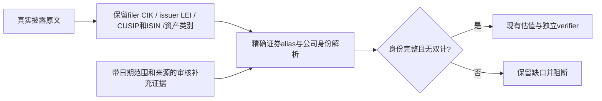
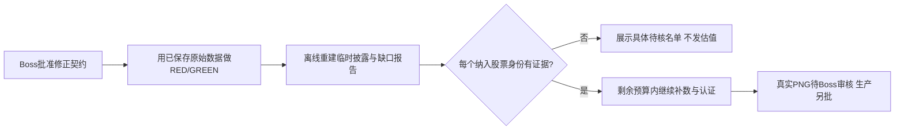

# 三指数披露源身份修复 Implementation Plan

> **For Claude/Codex:** 待 Boss 批准。批准后在现有 git worktree 按 Task 顺序 TDD 执行；复用现有 collector、MarketStore 和 verifier，不重写聚合。单主线程审查，不启动 subagent。当前 runtime 未提供 executing-plans skill，按以下 checklist 执行。

**Confidence: 90%**（修复路径明确，不代表真实历史覆盖率能达标）

**不确定点**：119个披露股票行的LEI缺口能否全部通过当期证券标识与primary证据解决；live新增证券的历史身份可用性；DISCA/DISCK市值及FOXA/NWSA类间市值约定仍待实际证据。不能承诺修完代码即可出五年全覆盖图。

**北极星对齐**：`docs/design/north-star.md` 第一层数据身份/原始数据/PIT边界 → 第二层可审计估值；北极星没有R编号，沿用原三指数计划R1聚合门、R3独立验证、R5尾部契约，不改策略或CIO方向。

**Goal:** 修复基金filer CIK/发行人/证券三种身份混淆，在不降低门槛的前提下恢复三指数真实数据试跑。

**Tech Stack:** Python3.10、SQLite additive migration、pytest、既有FMP client/披露normalizer/verifier。

## 证据

先读 `docs/audit/2026-09-11-index-pe-cloud-trial.md` 与 issue072。实际48次请求已证明：QQQ/SOXX各成分共享基金CIK，SPY TERN因基金不同被alias拒绝；live只给securityCusip；披露LEI/assetCat未存库；NQM6/NQU6期货误入股票集合。原始证据已保存在 `reports/rendered/index-pe-trial-20260911/evidence/`，开发先离线复现，不重新花额度取同样响应。

## Architecture

基金是谁、持有什么证券、证券属于哪家公司分别存证，不再用一个cik字段代替三者。

## Business Flow

## Alternatives

| 方案 | 优点 | 代价/风险 |
|---|---|---|
| A（推荐）：发行人LEI + 精确证券标识，缺口用带来源/有效范围的审核证据 | 利用现有披露，较少外部请求；能区分同公司不同股类 | LEI有缺口，不能只换字段，未知项必须停下 |
| B：为所有历史证券建立独立issuer CIK/security master映射 | 可与财报CIK体系统一 | 当前主池身份并不覆盖退市历史、ticker更名/重用和所有海外发行人；研究与维护面更大，不能拿当前ticker映射回填历史 |

不考虑关闭公司去重检查或使用ticker作为公司唯一键：两者都会重新允许同公司多股类净利润双计。

## 冻结契约

1. 原表`cik`保留原值并明确为`filer_cik`语义，不重命名清表，不填成issuer CIK。新增`issuer_lei`、`asset_category`、`raw_payload_json`用于保存供应商原文。旧行缺新字段保持NULL，不能推断为“已认证”。迁移必须additive且不影响其他Store使用方。
2. live的证券CUSIP读取`securityCusip`；若同时有`cusip`而二者冲突，拒绝该快照。原始输入仍完整保留。
3. 公司身份以经格式/校验位与primary样本验证的issuer LEI为主。缺失时仅允许**精确ISIN/CUSIP、明确历史有效范围、来源链接/哈希**的人工审核证据。禁止按名称模糊匹配、ticker单字段、CUSIP截前六位或使用基金CIK兜底。LEI候选统计不等于完成独立身份验证。
4. 身份证据按具体`(basket,holding_date,source_kind,raw_row_index)`归属，不能按effective_date把不同来源合并。Issuer identity证明证券所属主体，不证明股价/财报已同口径；仍保留原alias、mcap convention与NI守卫。
5. TERN→TER继续authoritative；精确CUSIP+ISIN匹配后不再依赖SOXX基金CIK。若证券标识缺失/冲突则拒绝。CREE→WOLF须独立补充更名期间证券证据，不能把原基金CIK去掉就当安全。
6. 披露以`assetCat=DE`等明确资产类别识别衍生品，保留原行与原因码；NQM6/NQU6无论正负权重、ticker是否非空都不进入股票财报universe。未知类别不默认为股票，现有现金/swap识别复用。
7. 维持source身份前置门和covered-member唯一性检查。已纳入/covered_by股票有身份缺口则停止该篮子；不改成“少数未知可以忽略”。Coverage的原始分母和90%双门不降，期货排除与未知股票排除不能混淆。
8. verifier独立从保存的源证据重建身份，不只比较producer新增的identity字符串。相同基金CIK/不同发行人应通过；同LEI的多个未合并股类必须报错。C1、manifest、R5、sample=50、现有数字口径全部保留。

## Tasks（每步完成后勾选）

### Task 0：真实端点契约回归

Files: 新增`tests/fixtures/index_pe_source_identity_20260911.json`、`tests/test_index_pe_source_identity.py`；扩展`tests/test_fmp_fund_disclosure_ingestion.py`、`tests/test_verify_index_pe_history.py`。

- [ ] 从已保存响应取公开的AAPL/GOOG/GOOGL/TERN/DISCA/DISCK/缺LEI/NQM6/live样本，保持真实cik/LEI/标识，不编造“每ticker不同CIK”。带原始响应hash。
- [ ] RED：不同发行人共享fund CIK不双计；Alphabet及Discovery同LEI股类会双计；SPY/SOXX同Teradyne证券应同样解析；缺证据和冲突必须失败。
- [ ] RED：LEI缺失不能靠基金CIK补齐；live securityCusip保留；NQM6/NQU6排除股票集合。
- [ ] 运行`python -m pytest -q tests/test_index_pe_source_identity.py tests/test_fmp_fund_disclosure_ingestion.py`确认失败原因是契约而非fixture缺环境。

### Task 1：原始身份存储与adapter

Files: `src/data/market_store.py`、`src/data/fmp_forward_ingestion.py`、`tests/test_market_store_historical_basket_valuation.py`。

- [ ] additive迁移增加三列，历史表有数据时仍能构造Store；旧行保留、新字段为NULL。不得删除或猜测补齐。
- [ ] normalizer保留issuer LEI/assetCat/raw payload，读取live正确CUSIP字段，冲突拒绝；原filer CIK不改。
- [ ] 将资产类别识别前置并复用现有排除原因，阻断有ticker期货进入逐股请求。
- [ ] storage round-trip与旧schema/已有行测试GREEN；3.10 AST、focused测试通过后commit。

### Task 2：精确证券alias与独立公司身份检查

Files: `config/soxx_symbol_aliases.json`、`src/data/fmp_forward_ingestion.py`、`scripts/verify_index_pe_history.py`、`scripts/backfill_index_pe_history.py`、Task0 tests。

- [ ] TERN配置与解析改为精确证券标识契约；CREE另有证据前保持拒绝，不删除其守卫。
- [ ] 添加严格issuer identity解析；任何审核例外必须带来源/有效范围/精确证券标识，且不能覆盖冲突源值。普通缺数据留UNKNOWN。
- [ ] producer在逐股请求前验证源身份；verifier从原始列和审核证据独立重建，再检测同公司多股类，按具体快照隔离。
- [ ] 全部真实契约用例GREEN；注入基金CIK变化/LEI冲突/同日多快照/live未来可用日，确保无法绕过。
- [ ] 运行三指数、Store、FMP ingestion、forward valuation相关测试与主线程review，再commit。

### Task 3：离线重放并报告剩余真实缺口

- [ ] 对现有临时库再做本地副本，使用48个原始响应重建源；保留原fetched_at/acceptedDate，不产生新PIT vintage。
- [ ] 完整列出每快照LEI缺口、双股权组、证券标识冲突及非股票排除，带原始权重。SPY缺的后续披露仍须在预算内补取。
- [ ] 复查GOOGL/GOOG的1,248对同日市值结果；DISCA/DISCK补证据，FOXA/NWSA不能只因两类市值不同就决定相加。
- [ ] 身份仍不完整则停下交待核名单；完整后才续跑网络补齐，不为生成图表放宽门槛。
- [ ] 续跑所有HTTP从既用48次扣除，最多另2,952次；原3小时窗口若已过则重新请求时间窗口，不自动延长。不写生产、不部署。

## 风险自证与回滚

最大风险是把“LEI非空”当成身份完整，重复同一种字段迷信。因此保留原文、精确证券标识和有效范围，缺失明确阻断；不强求这次一定出图。

更简单的“把cik改成lei”无法处理119个缺口、live无LEI、丢失CUSIP、基金限定alias和期货误入股池。上述任务是恢复现有身份门的最小闭环，不新增通用跨市场security-master平台。

只在worktree与临时DB副本修改；旧副本和源响应保留，代码可revert，新临时库失败即弃用其产品，不反向覆盖生产。任何已有认证结果的源修正仍须整窗重算并过C1，不手改hash/ownership。

## 验收标准

- [ ] 相同基金CIK不再让不同公司被判成一家；同一发行人不同股类仍被可靠检测。
- [ ] 同一Teradyne证券在SPY与SOXX均映射TER，Terns证券不可映射TER。
- [ ] live CUSIP无静默丢失，缺失issuer证明的行不能获得已认证身份。
- [ ] 期货不进入股票补数；原始行和权重排除证据完整保留。
- [ ] 剩余缺口有准确名单，无法满足时显示FAIL而非补造公司ID。
- [ ] 保留365项当前相关基线、此前C1/manifest/R5行为；最终采用隔离数据副本全量测试。
- [ ] 真数据身份、覆盖、独立计算全过才生成真实PNG；该阶段仍不代表获准进生产晨报。
