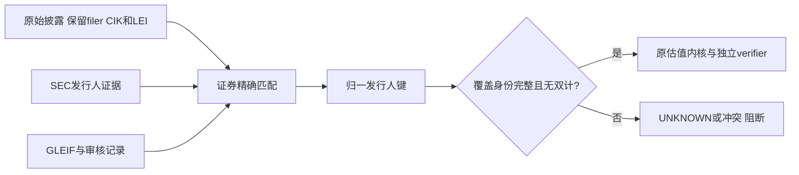
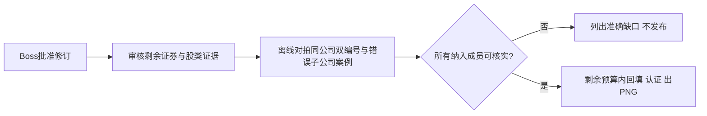

# 三指数可核实发行人键修订（待 Boss 批准）

> 本文件仅提出对既有方案A的必要修订，尚未实施；延续单主线程、TDD、隔离worktree与临时DB，禁止merge/push/部署生产。当前runtime没有executing-plans skill，按任务清单执行。

**Confidence: 85%**（字段契约可实现，真实证券覆盖仍须逐项核实）

**不确定点**：未注册/未找到LEI的发行人、法人重组前后身份连续性，以及衍生/境外证券缺CUSIP时的替代证明。**不承诺数据完整率，不放宽原门槛。**

**北极星对齐**：既有north-star第一层Data身份/证据/PIT边界→第二层指数估值；沿用原计划R1/R3/R5与C1，不建设通用security-master平台，不改PE公式。

**Goal:** 要求发行人身份有充分证明，而不是强制每个发行人都有LEI；用带类型、可归一的身份键关闭剩余数据缺口。

**Tech Stack:** 现有Python3.10、JSON审核证据、SQLite source/raw字段、producer与独立verifier。

## 已有证据与边界

2026-09-11首批12证券补证已经按原规则落入配置（78411b9），云端独立对账解决133条，缺口463→330、41证券→29。核心代码未改，原始N/A未改写。GLEIF公开查询65次，FMP累计仍71次。

真实问题不再只是“缺一个字段”：

- Marvell的LEI初始注册日为2026-02-20，但本次窗口包含2021年以来的同一证券。已补证明确标为**现在审核的历史实体映射**，不冒称当时已有此LEI。
- Cintas披露候选LEI对应LATM Management Company LLC；KHC的部分LEI对应Kraft Heinz Foods Company，另一个才是上市母公司。不得把有关联公司当作同一个法律实体。
- 部分source的CUSIP是N/A或000000000，但仍给出明确ISIN；现有override schema一律要求有效CUSIP，因此不能表达这种已可独立核实的证券。
- GLEIF按ISIN查询无结果只能记未找到，不等于已经证明公司没有LEI。对MTSI搜索命中的运营公司LEI，也不能直接赋给上市Holdings。

详研究审计`docs/audit/2026-09-11-index-pe-issuer-evidence-followup.md`及保存的GLEIF响应。

## Architecture

只扩展身份证据表达，不新建估值内核。

## Business Flow

## Alternatives

| 方案 | 优点 | 代价 |
|---|---|---|
| 继续LEI+双证券编号硬要求 | 不改schema | 有效但无LEI/无CUSIP的证券会一直阻断，继续抓相同端点不能解决 |
| **推荐：经核实的issuer CIK或LEI+精确证券证据** | 对应业务需要的“哪个公司”，覆盖真实编号差异 | 必须做编号归一、历史有效范围和母子公司防混淆 |

降低到90%“身份已知”、直接忽略未知、或把ticker当issuer key都不采用。

## 待审批契约

1. 增加有类型的`canonical_issuer_key`（例如`sec-cik:000...`或`lei:...`）。**SEC发行人CIK来自明确发行人记录，绝不用基金披露的filer CIK，也不单凭当前FMP profile.cik。**所有CIK必须校验长度、非零和证券对应关系。
2. LEI与CIK只有在证据表明是**同一法律实体**时才能归一为一个键。不能简单拼不同前缀后就视为两个公司；同公司股类分别给LEI/CIK也必须归一并检测双计。
3. 缺CUSIP时可用经独立核实的**完整ISIN**匹配，必须显式声明match mode与原缺失值，不能把缺CUSIP当任意CUSIP通配。如果source同时有两个有效编号，两者必须都匹配，冲突拒绝。禁止由ISIN猜CUSIP或补假编号。
4. 原始LEI错误但可证明正确发行人时，允许**精确证券+有效日期+预期错误值+权威证据**的定点纠错；原始值保留，派生字段记录纠错理由。不允许无条件覆盖或把子公司LEI全局映射成母公司ID。新出现、未审查的冲突仍阻断。
5. 原有12条reviewed LEI记录兼容；不强迫所有现有正常LEI迁移到CIK。新增CIK例外必须同时解决它与本篮子内已知同实体LEI/股类的归一问题，否则拒绝该例外，不能制造跨命名空间的双计盲区。
6. 继续100%纳入成员身份门、90%估值mcap/weight双门、7天staleness、sample=50及C1整窗认证。LEI/CIK本身不是财报币种、股数或market-cap convention的证明。
7. 发行人映射是现在审核的历史身份事实，保存reviewed_at和valid_from/to；不改holding日期、acceptedDate、earnings vintage，不把新查到的分析师预测当历史PIT。

## Tasks（审批后）

### Task 0 — 真实边界RED

Files: `tests/test_index_pe_source_identity.py`、`tests/test_reviewed_issuer_evidence.py`。

- [ ] 以已保存OLED/MTSI/CRDO/CTAS/KHC案例，补无LEI但有发行人CIK、CUSIP缺失但有ISIN、母子公司不可混并的失败测试。
- [ ] 补同公司两个股类分别用CIK/LEI仍被归一并报双计；不同公司各用一种编号应独立。
- [ ] 补冲突证券编号、未审查的源LEI、越过有效范围、空CIK/filer CIK误用全部拒绝。
- [ ] 运行`python -m pytest -q tests/test_index_pe_source_identity.py tests/test_reviewed_issuer_evidence.py`，确认RED来自新增契约。

### Task 1 — 审核证据schema与归一

Files: `src/data/fund_issuer_identity.py`、`config/baskets/issuer_identity_overrides.json`、`docs/references/index-pe-issuer-evidence-20260911/`。

- [ ] 兼容旧记录，增加明确issuer key、匹配方式、同实体ID集合、纠错预期值；strict parser拒绝不完整配置。
- [ ] 实现精确证券/日期匹配与有证据的ID归一，不改原始source表。审核记录的哈希必须可由保存文件重放。
- [ ] 单个原始LEI可以是不同证券上的误填值；纠错必须按证券作用域，不能全局union子公司与母公司。
- [ ] 缺证据返回UNKNOWN，冲突不采用“优先选第一个”。测试GREEN后commit。

### Task 2 — 独立verifier接线

Files: `scripts/verify_index_pe_history.py`、`scripts/backfill_index_pe_history.py`及相关tests。

- [ ] producer输出身份来源/纠错说明；verifier独立从raw与审核文件重建同一规范键，不只相信producer写入的字符串。
- [ ] 对齐物理快照归属，跨来源/跨年份/未公开快照不得借身份覆盖。
- [ ] 复跑416项相邻基线与隔离数据副本全量；主线程review修完再commit。

### Task 3 — 真数据闭环

- [ ] 核实剩余29证券，不把搜索无结果冒称不存在；报告新增发现的“有值但错”记录。
- [ ] 为DISCA/DISCK、UA/UAA补同发行人和类间市值证据；FOXA/NWSA未证实约定仍不相加。
- [ ] 只在临时库重放并统计每个缺口如何关闭，原始source哈希必须不变。
- [ ] 身份及股类口径完整后才逐股回填、两个verifier、真实PNG；未通过继续给准确缺口，禁止“为了出图”撤门。

## 风险自证与验收

最大风险是ID种类增加后把同一公司当两家、或把母子公司强行并成一家。解决依靠经验证的同实体关系和显式证券作用域，不靠名称相似或关联地址。

- [ ] 同实体双编号不双计，母子公司不同实体不全局合并。
- [ ] 已核实的ISIN-only记录可用，但有效CUSIP冲突不能绕过。
- [ ] 定点纠错只命中批准的错误值/日期/证券，未知新冲突拒绝。
- [ ] 原始值、PIT时点、PE公式及所有覆盖门保持。

回滚：保留旧代码和两份临时库；新审核记录不影响原始source。失败时停用新派生结果，不恢复整库覆盖生产。网络额度仍是FMP累计71/3000、余2929；原试跑截止2026-09-11T10:35:35Z，超时需Boss另批，不自动续期。生产merge/push/部署仍另批。
