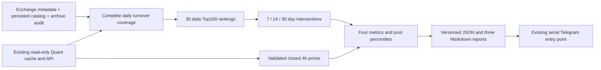
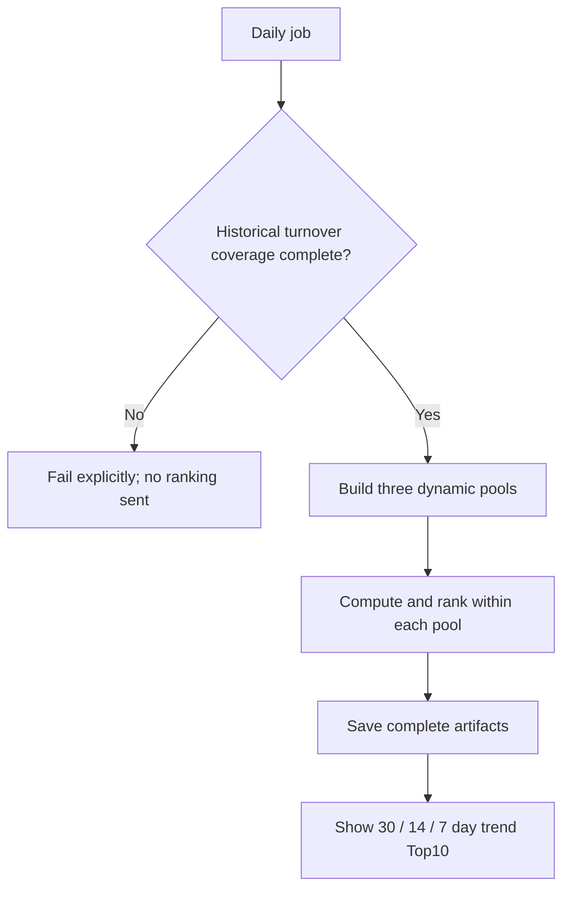

# Crypto trend rankings — approved behavior and implementation plan

Boss approved DSH implementation on 2026-09-19 after choosing separate 7/14/30-day pools. This changes the existing scanner, not the desk architecture. North-star alignment: data layer supplies verified price/volume; technical analysis layer describes trends. Scores are descriptive, not validated return forecasts or trading instructions.

## Approved behavior

- Binance COIN USDT perpetual contracts; quote turnover in USDT, not token units or rolling ticker/24hr volume.
- As of yesterday's complete UTC day, construct a top-100 turnover ranking for EACH of the last 30 days, using contracts eligible on that date, including subsequently delisted contracts.
- Pool H = intersection of all H daily top-100 sets, H in 7,14,30. No padding. Today's non-tradable contracts cannot be trading candidates, but must still compete in their historical daily volume rankings.
- For each pool, compute from complete 4h closes: H*6 returns and H*6+1 closes. Same UTC endpoint for prices and volume.
- Raw metrics: period simple return; absolute net log return / sum absolute log returns (ER); OLS log-close vs bar-number slope and R²; current drawdown from highest WINDOW CLOSE (includes initial close).
- Valid flat paths have ER=0, R²=0, slope=0; no division by zero. Invalid prices or missing/duplicate bars are unavailable, never filled.
- Uptrend display requires return>0 and slope>0. Percentiles use all valid measured pool members BEFORE this direction gate. This matches 'pool内计算指标加排名'.
- Percentile = 100 * count(values <= value) / valid_count, per metric/window; score drawdown using its negative (smaller positive drawdown is better). Equal metrics receive equal ranks.
- Initial descriptive weights inherited from agreed dimension grouping: return 40%, ER 20%, R² 20%, current-drawdown 20%. Do not call these optimized weights. Do not copy screenshot's ER>=0.10 threshold.
- Output Top10 per horizon (30→14→7), show pool size, valid count, uptrend count, component raw values/percentiles and full member records in JSON. Empty qualified pools/uptrend lists are legitimate, no padding. A nonempty pool with zero usable prices is an error.
- Remove RS/Beta from the NEW output and ranking; preserve historical tools for reproducibility. BTC is an ordinary candidate under the same rules.

## Architecture

## User flow

## Choices and risks

| Choice | Benefit | Cost / decision |
|---|---|---|
| Current-symbol-only retrospective rankings | Simple | Reject: excludes past delisted competitors and can wrongly admit rank 101 |
| Effective-dated historical catalog + complete day coverage | Faithful rolling membership | Selected; unknown history fails closed; no claim of original PIT vintages |
| Replace old math helpers | Less legacy code | Reject: old replay tools depend on them |
| New trend module, route existing run entry to it | Reuses cache/API/window validation; preserves replay | Selected; new artifact schema/names prevent mislabeled old RS data |

Greatest risk is a missing contract/day silently promoting another coin into Top100. Require complete candidate/day audit and historical catalog evidence; do not fill missing volume with zero or quietly skip network failures. Pending/not-yet-open contracts must be distinguished from unknown gaps by explicit evidence. Reuse existing scanner API/serial rate limiting and time-window helper. Full historical metadata is reconstructed from evidence, not guaranteed historical exchangeInfo vintages; state this limitation.

## Checklist and acceptance

- [x] DSH first writes failing semantic tests; record RED output. Two output-cap failures then one successful metric-only task; Codex implemented remaining modules with RED/GREEN tests.
- [x] Lifecycle-aware daily rankings and intersections, immutable raw inputs / read-only shared cache.
- [x] Four metric math, percentile denominator, gates, stable ties and bad-data behavior.
- [x] Existing daily/shim entry produces only new reports, no RS/Beta output; no change to PMARP/RVOL/NUPL.
- [x] Local/cloud relevant suites 123 passed each; Python 3.10 compile; frozen dry-run without API/Telegram.
- [x] Independent 3000 daily rank rows/141 coin-windows and main-thread /cr; 3693 passed/12 baseline failures/4 skipped in full suite. Six further tests pass in final relevant suite.
- [x] Audit, session digest, ongoing state, explicit-file commit. Preserve branch; merge/push/deployment are outside this turn's implementation authorization.

API budget: reuse all cached daily histories; serial backfill only unresolved candidate histories. At most ~100 4h candidate histories per run because pools are nested. Archive/catalog discovery is read-only and cached with an explicit date; never count an API failure as empty evidence.
