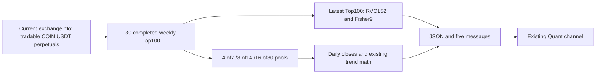
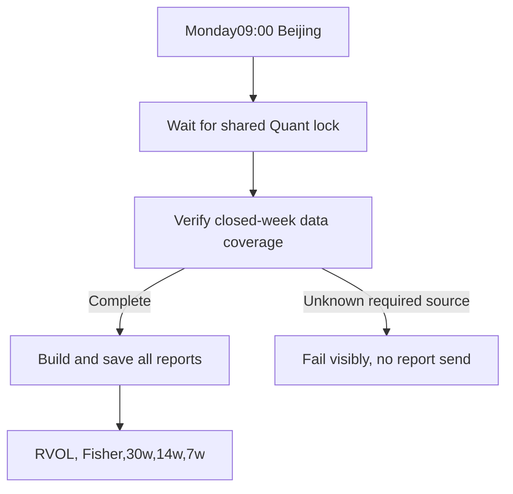

# Crypto weekly report — approved scope and implementation status

Boss confirmed the five business choices on2026-09-20. Extends the existing scanner; north-star data and technical-analysis layers, no architecture direction change.

## Agreed behavior

- Preserve daily reports. Add Monday09:00 Asia/Shanghai weekly report via existing Quant Telegram channel; shared daily scanner lock serializes resource use.
- Binance COIN USDT perpetuals. Latest completed native week closes Monday00:00UTC,08:00Beijing. Never include the current partial week.
- **2026-09-20 user update**: 周报币种池改为**当前可交易合约回看**——仅 Binance COIN USDT 永续且 `status=TRADING`、`onboard ≤ 报告截止 < delivery`。已下架/SETTLING/PENDING/历史缺席合约从所有周成交额排名、RVOL/Fisher 与 7/14/30 周趋势池排除；保留 7/14/30 周历史周 Top100，但在当前合格池内回放。报告需明确标注「当前可交易合约回看，已下架排除，非历史全市场快照」。日频历史全市场行为不变。
- Latest completed week quote-turnover Top100 selects RVOL and Fisher. Turnover means USDT quote volume. Top100 仅在当前可交易池内产生。
- RVOL: current weekly turnover vs previous52 complete weeks, population standard deviation; valid Top20 bysigma, no threshold or pool replacement. Insufficient53weeks/zero std is unavailable.
- Fisher9: weeklyHL2, Ehlers smoothing/clamp, Trigger=priorFisher. New up/down crossings on latest completedweek; equality allowed on priorweek. Fixed Top100 denominator, unknowns separately reported. Fetch500nativeweeklybars for warmup; missingfirstpartiallistingweek excluded.
- Trend7/14/30weeks, DAILY closes:49/98/210returns and50/99/211closes. Separate pools require4/8/16weeks in each historical weeklyTop100. Same fourmetrics, weights40/20/20/20, all-valid-pool percentile denominator, positive return+slope filter, Top10. Pools can be non-nested and exceed100.

## Implementation choices

Reuse the existing transport, RVOL, trend metrics and scoring kernels. Weekly reports have a dedicated adapter, cache, shim and wrapper; the daily entry remains in place.

| Choice | Effect | Decision |
|---|---|---|
| Reconstruct historical all-market universe, including removed contracts | Historical ranking includes formerly traded contracts; requires delisted metadata and terminal-day archives | Not used for weekly report after Boss said “下架的就不需要了” |
| Replay historical weekly turnover among currently tradable contracts | Excludes removed/SETTLING/PENDING contracts from every ranking; current-contract gaps still fail | Selected; explicitly label current-universe replay |

The weekly adapter obtains one current exchangeInfo snapshot and never reads historical catalogs or archive listings. Only current TRADING contracts with onboard ≤ cutoff < delivery are fetched. Missing data for a currently eligible contract remains an error; no invented zero volume or fallback selection.

## Checklist

- [x] DSH implemented the report and the current-only universe. Three invocations total: two reached the step limit; the third completed. Codex reviewed the actual changes and completed acceptance.
- [x] Final focused tests: 217 passed locally, in isolated cloud validation, and in production. Daily regression tests retained.
- [x] Final full suite: 3789 passed, 12 existing failures, 4 skipped. Failure IDs exactly match the baseline; seven missing research-data fixtures and five morning classification mismatches.
- [x] Independent native weekly data and standard-library math reproduced RVOL and Fisher for 100 selected contracts, cutoff 2026-09-14.
- [x] Current-universe real dry-run: 526 contracts, 3000 weekly Top100 records, 1040 metric checks, all three pools and Top10 rankings independently verified. Shared-lock timeout and subsequent execution tested.
- [x] Merged, pushed and deployed runtime 4632cd7 under the shared Quant lock. Added only the Monday 09:00 job; existing cron bytes and daily script hashes unchanged. Backup: Quant/backups/crypto-weekly-20260920T032749Z/.
- [x] Production dry-run and independent verification passed without sending messages. First natural run: 2026-09-21 09:00 Beijing; not yet observed.

The earlier AERGO boundary-proof option was superseded by the explicit current-universe decision; no such fallback is implemented.
