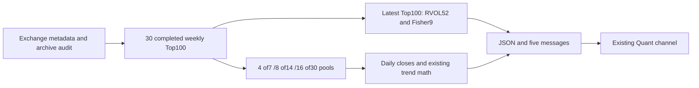
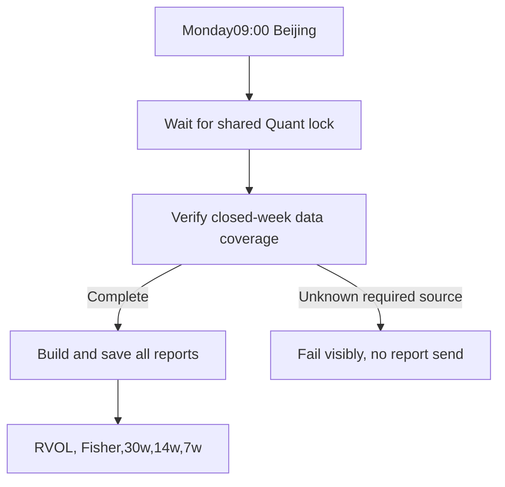

# Crypto weekly report — approved scope and implementation status

Boss confirmed the five business choices on2026-09-20. Extends the existing scanner; north-star data and technical-analysis layers, no architecture direction change.

## Agreed behavior

- Preserve daily reports. Add Monday09:00 Asia/Shanghai weekly report via existing Quant Telegram channel; shared daily scanner lock serializes resource use.
- Binance COIN USDT perpetuals. Latest completed native week closes Monday00:00UTC,08:00Beijing. Never include the current partial week.
- Latest completed week quote-turnover Top100 selects RVOL and Fisher. Turnover means USDT quote volume.
- RVOL: current weekly turnover vs previous52 complete weeks, population standard deviation; valid Top20 bysigma, no threshold or pool replacement. Insufficient53weeks/zero std is unavailable.
- Fisher9: weeklyHL2, Ehlers smoothing/clamp, Trigger=priorFisher. New up/down crossings on latest completedweek; equality allowed on priorweek. Fixed Top100 denominator, unknowns separately reported. Fetch500nativeweeklybars for warmup; missingfirstpartiallistingweek excluded.
- Trend7/14/30weeks, DAILY closes:49/98/210returns and50/99/211closes. Separate pools require4/8/16weeks in each historical weeklyTop100. Same fourmetrics, weights40/20/20/20, all-valid-pool percentile denominator, positive return+slope filter, Top10. Pools can be non-nested and exceed100.

## Implementation choices

Reuse market adapter/scoring kernels with backward-compatible optional arguments; separate weekly module,cache,shim,wrapper. Replacing the existing daily entry would violate the requested retained daily report. Current-survivor-only historical ranking is simpler but rejected because removed contracts can change Top100 membership.

Greatest risk: missing historical turnover silently promotes rank101. Catalog audit widens30days→210days. Missing data is not zero; failure remains explicit.

## Checklist

- [x] DSH implementation and correction, isolatedworktree; two runs both reached40-step limit, status is not claimed as successful handoff.
- [x] Codex review and211focused tests PASS; daily tests retained.
- [x] Independent native1w vs dailyaggregate RVOL and Fisher recursion,100selected symbols PASS, cutoff2026-09-14.
- [x] Full suite:3781passed/12samebaselinefailures/4skipped. One interrupted networkcallback test individually reran1PASS. Final metadata-ordering change separately covered by focused211PASS.
- [ ] Resolve historical AERGO/BDXN metadata and AERGO terminal-day volume coverage. User policy clarification pending; strict fail retained.
- [ ] Real complete report dry-run and independent weeklypool/score acceptance.
- [ ] Merge/push/deploy cron, preserving daily schedule, after source coverage is resolved.

Independent diagnostic bounds for last closed week found identical pools with AERGO inside/outside its uncertain historicweek. This is not source-complete evidence and is not yet permitted as a production fallback.
