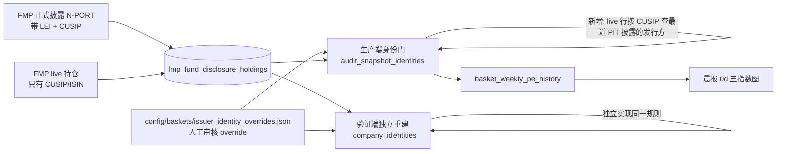
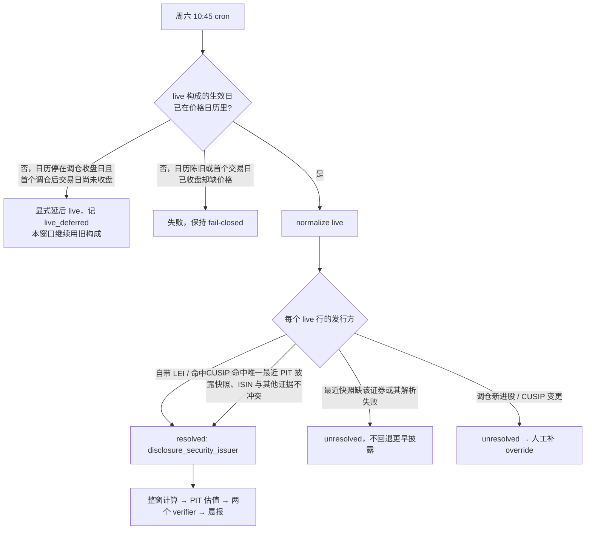

# Index PE Live Issuer Identity + Rebalance Calendar Boundary Implementation Plan

**Goal:** 让三指数 PE 周更在季度调仓后恢复：live 持仓行按证券代码从最近正式披露继承发行方身份，调仓周末不再因"下一交易日未发生"报错。
**Architecture:** 身份门仍只接受证券级证据（LEI / 审核 override），新增第三种证据"同篮子、PIT 可用的最近正式披露中 CUSIP 相同的行已解析出的发行方"。生产端（`src/data/fund_issuer_identity.py`）与独立验证端（`scripts/verify_index_pe_history.py::_company_identities`）各自实现，不共享代码。调仓周末 live 构成在其生效交易日出现前显式延后抓取。
**Tech Stack:** Python 3.10（云端）、sqlite3、pytest。
**Spec:** `docs/issues/2026-09-19-index-pe-rebalance-calendar-boundary.md`（含 2026-09-25 follow-up）；约束来源 `docs/runbooks/index-pe-weekly-window.md`、issue077。
**北极星对齐:** 第一层 数据层（数据采集 + 验证）。修复既有 Data Desk 周频估值产品的可用性，不改 PE 口径、不改晨报读取路径。

## 架构图



## 业务流程图



## 替代方案

| 方案 | 优点 | 缺点 |
|---|---|---|
| **A. 从最近正式披露按 CUSIP 继承发行方（选）** | 证据仍是证券级、来自已审核通过的披露；每季度只剩新进股（本次约 11 只）需要人工 override | 生产端和验证端各写一遍；新进股每季度仍需人工审核 |
| B. 全部 live 行走 GLEIF ISIN→LEI 自动查询 | 几乎零人工 | 新增外部依赖和一条自动化信任链，等于把人工审核门换成自动门，改动面大；YAGNI |
| C. 不改代码，等正式披露 | 零开发 | 按 issue077，live 早于披露可用时仍须过门，等不来；每季度重复卡死 |

## 风险自证

- **最大风险：错配发行方**（把 A 公司的市值和 B 公司的利润放进同一只成分股）。对策：只按 CUSIP 精确匹配（不看 ticker）；两侧 ISIN 都有时必须一致，否则判冲突；**先从同篮子全部披露快照（不论其中行是否解析成功）选出唯一一份"最近 PIT 披露"**（`holding_date` 与 `composition_available_date` 都 ≤ live `holding_date` 中 `holding_date` 最大者），只在这一份里查该 CUSIP；该快照里缺这只证券、或这只证券的披露行自身解析失败 → 这条证据不存在且**不回退更早的披露**；披露行自己的发行方要先经 `resolve_issuer_identity` 解析成功（override 修正照常生效）。
- **证据合并对称**：live 行的全部适用证据（自带 LEI、override、披露继承）无条件合并进 candidates，任意两者不一致 → `issuer_evidence_conflict`。生产端与验证端都按这一条执行，不是"原逻辑失败才查披露"。
- **验证端同错同过**：验证端不 import 生产端，按同一书面规则独立实现（遵循"verifier 复用 producer 内核 ≠ 独立验证"），并有对拍测试（成功、冲突、缺失三类）。
- **延后逻辑掩盖日历陈旧**：延后只证明"调仓后的第一个交易日还没收盘"，不用天数宽限。条件同时满足才延后：日历最后一天 == 推断的调仓收盘日；`fetched_at`（UTC）早于"调仓收盘日之后第一个工作日 20:00 UTC"（取夏令时收盘 16:00 ET，冬令时下更保守）。该收盘时刻已过但价格仍停在调仓收盘日 → 原样报错（价格缺失，不是尚未发生）。遇周一休市时手动运行会 fail-closed，可接受；生产 cron 只在周六跑。
- **为什么不更简单**：只修日历（issue 原方案）不够，9/25 预检证明身份门 100% 挡住 live；只改生产端不改验证端，verifier 会判不一致失败。

## 验收标准

1. 新增和既有测试全部通过：`pytest tests/test_index_pe_source_identity.py tests/test_backfill_soxx_historical_pe.py tests/test_backfill_index_pe_history.py tests/test_verify_index_pe_history.py tests/test_reviewed_issuer_evidence.py -q`，再跑全量 `pytest -q`，贴输出。
2. 云端只读预检（命令与停止边界见下方"预检停止边界"）：补 override 前，身份门错误只剩新进/换 CUSIP 的证券（预期 SPY 7：XOM、BE、OKE、FERG、ILMN、P、RDDT；QQQ 1：SPCX；SOXX ≤3：SKHYV、TSEM.TA、CBRS，其中被过滤的行不计）；补 override 后三个篮子都越过身份门。
3. 单测复现 9/19 场景：日历停在 9/18、周六抓取 → `live_deferred`，不再抛 `no trading date after 2026-09-18`；同样日历、9/22 抓取（9/21 已收盘）→ 仍报错。
4. 部署并恢复后：`basket_weekly_pe_history` 三个篮子最新 `valuation_date` 推进到恢复窗口末周；`verify_index_pe_history --mode ro` 通过；次日晨报 `0d` 无过期标记。

### 预检停止边界

预检只验收身份门，不验收之后的基本面 / 市值 / 拆股 / FX 阶段。`--dry-run --allow-network` 在身份门通过后会继续跑五年窗口的这些阶段，而 `--max-api-requests` 默认是 None（无上限），所以必须带预算：

```bash
# 部署前在本地 worktree（--db 指向刚 pull 的主仓库 data/market.db）；部署后可在云端同样执行
# 逐篮子单进程；FMPClient 为每个进程独立计数
timeout 3600 python3 scripts/backfill_index_pe_history.py --baskets <B> --frequency weekly \
  --years 5 --as-of 2026-09-26 --dry-run --allow-network --max-api-requests 8 \
  --db <主仓库>/data/market.db
```

- 预算依据：来源阶段每篮子正常 2 次（披露日期列表 1 + live 持仓 1）；若新季度披露已上架再加 1；留出重试余量后取 8。三个篮子合计最多 24 次。
- 停止方式：身份门之后的阶段一旦需要联网，就会在第 9 次请求时抛 `RuntimeError: FMP request budget exhausted (8)`；`backfill_index_pe_history.py:466` 会把已完成部分的报告挂在异常上，报告里保留 `source_identity`。若之后阶段恰好不需要联网，就在只读计算后自然结束或被 `timeout` 截断，同样不写库。
- 验收只看：`baskets.<B>.source_identity` 存在且 `errors`（补 override 前应只剩新进证券，补后为空），以及 `api_requests_used <= 8`。若 `source_identity` 缺失（预算在来源阶段就用完），这次预检无效，报 Boss，不加大预算重跑。
- 之后阶段的结果（budget exhausted / 超时 / 完成）不作为任何验收依据。

## Global Constraints

- 云端是 market.db 唯一写入方；恢复运行沿用 `market_db_writer` 外层资源锁与备份；本地禁止写 market.db。
- 不 tail-only 补写、不修改旧 completed、不改写旧 frozen vintage；恢复用新 run_id 跑完整五年窗口 → PIT valuation phase → verifiers，不重跑整次 forward ingestion。
- CUSIP/ISIN 不足或冲突时不允许 ticker-only 推断，不允许用旧构成冒充新构成（issue077）。
- raw ticker、raw payload、fetched/accepted/effective 日期和权重保持原样。
- 实测 SPY 零 HTTP 整窗约 46 分钟；恢复不得与周六 10:45 forward / 14:00 fundamental 争写锁。
- merge、push、云端 pull、恢复运行每一步单独请 Boss 确认。

---

### Task 1: 调仓周末 live 显式延后

**Files:**
- Modify: `scripts/backfill_soxx_historical_pe.py:453-485`（`_fetch_sources` 的 live 分支，`live_rebalance = ...` 起）
- Test: `tests/test_backfill_soxx_historical_pe.py`

**Interfaces:**
- Produces: `report["stages"]["source"]["live_deferred"] = {"rebalance_close_date": str, "expected_first_session": str, "expected_close_utc": str, "fetched_at": str, "calendar_end": str}`（仅延后时出现）；不延后时行为不变。

- [x] Step 1: 写失败测试（沿用该文件已有的 fake client / state 构造方式；fake client 记录 `get_etf_holdings` 调用次数）：
  - `test_live_deferred_on_rebalance_weekend`：日历止于 2026-09-18，fetched_at=2026-09-19T04:00:00Z，断言不调用 `get_etf_holdings`、不抛异常、`live_deferred` 字段齐全（`expected_first_session == "2026-09-21"`）、state 里没有新 live 行。
  - `test_live_deferred_before_first_session_close`：日历止于 2026-09-18，fetched_at=2026-09-21T15:00:00Z（周一美股盘中）→ 延后。
  - `test_missing_prices_after_first_session_close_fail`：日历止于 2026-09-18，fetched_at=2026-09-22T02:00:00Z（9/21 已收盘，价格缺失）→ 抛 `ValueError`。
  - `test_live_normalized_once_post_rebalance_session_exists`：日历含 2026-09-21，fetched_at=2026-09-26T04:00:00Z，断言调用 live 并得到 `composition_effective_date == "2026-09-21"`。
  - `test_stale_calendar_still_fails`：日历止于 2026-09-10，fetched_at=2026-09-19T04:00:00Z → 抛 `ValueError`。
- [x] Step 2: `pytest tests/test_backfill_soxx_historical_pe.py -k "live_deferred or first_session or post_rebalance or stale_calendar" -v` → 两条延后用例 FAIL（当前抛 `no trading date after`），其余按现状 PASS/FAIL 记录
- [x] Step 3: 在 `live_rebalance` 计算后、`live_exists` 判断前插入：`calendar_end = max(state.trading_dates)`；`first = live_rebalance 之后第一个工作日`；`close_utc = datetime(first, 20:00, UTC)`；若 `calendar_end == live_rebalance and fetched_at < close_utc`，写 `live_deferred`、`skipped += 1`，跳过 live 抓取；其余情况原路径不变（陈旧日历、已收盘缺价格都由 `next_trading_date` 原样报错）。
- [x] Step 4: 同上命令 → PASS；再跑整个文件确认 `test_disclosure_supersedes_live_for_same_rebalance_effective_date` 等既有用例不变
- [x] Step 5: `git commit -m "fix(valuation): defer live index composition until its first effective session exists"`

### Task 2: 生产端身份门接受"最近 PIT 披露的同 CUSIP 发行方"

**Files:**
- Modify: `src/data/fund_issuer_identity.py:116-167`（`resolve_issuer_identity`）、`:170-200`（`audit_snapshot_identities`），新增 `disclosure_security_issuers(rows, overrides)`
- Modify: `scripts/backfill_index_pe_history.py:346-358`（在 `_window_snapshots` 之前保留全部 snapshot 行传给身份门）
- Test: `tests/test_index_pe_source_identity.py`（fixture `tests/fixtures/index_pe_source_identity_20260911.json` 已有 `spy_AAPL` disclosure 与 `live_aapl` live）

**Interfaces:**
- Produces: `disclosure_security_issuers(rows, overrides=()) -> Dict[Tuple[str, str], Dict[str, Any]]`：由同篮子**全部** `source_kind == "disclosure"` 行（不论解析成败）构建；key=(basket_symbol, disclosure holding_date)，value=`{"composition_available_date": str, "securities": {cusip: (issuer_key 或 None, isin, status)}}`；**解析失败的行也收录**（issuer_key=None, status=`"unresolved"`）；同一快照内同 CUSIP 出现不同 key 或不同 ISIN 时 issuer_key=None, status=`"conflict"`。
- Produces: `latest_pit_disclosure(security_issuers, basket_symbol, as_of) -> Optional[Tuple[str, str]]`：在上面映射里取该篮子 `holding_date <= as_of and composition_available_date <= as_of` 的最大 `holding_date` 对应 key；没有则 None。
- Produces: `resolve_issuer_identity(row, overrides=(), security_issuers=None)`：对 live 行，当 `security_issuers` 非 None 时，先由 `latest_pit_disclosure` 定唯一快照，只在该快照里查 live CUSIP（CUSIP 在 `MISSING_CUSIPS` 中则不查）：
  区分"没有可用证据"与"证据冲突"，两者都**不回退更早快照**：
  - **没有可用证据**（不增加 candidate，交给自带 LEI / override 等其他有效证据决定，全都没有则 `issuer_identity_unresolved`）：快照不存在；快照里没有该 CUSIP；快照里有该 CUSIP 但该行自身解析失败（issuer_key 为 None 且不是冲突）。
  - **证据冲突**（直接阻断）：快照内同 CUSIP 出现不同 issuer_key（映射里标记为冲突）→ `(None, "issuer_evidence_conflict")`；两侧 ISIN 都非空且不同 → `(None, "issuer_evidence_conflict")`。
  - 否则把 issuer_key **无条件**并入 candidates（与自带 LEI、override 同等），`len(candidates) > 1` → `issuer_evidence_conflict`；唯一且仅来自披露时 reason=`disclosure_security_issuer`。
  - 为区分两种 None，`disclosure_security_issuers` 的 securities 值改为 `(issuer_key 或 None, isin, status)`，status ∈ {`"resolved"`, `"unresolved"`, `"conflict"`}。
  - disclosure 行不受该参数影响。
- Produces: `audit_snapshot_identities(rows, overrides=(), source_rows=None)`；`source_rows` 为 None 时行为与现在完全相同；否则用 `disclosure_security_issuers(source_rows, overrides)`；resolved 条目在披露来源下附 `evidence_disclosure_date`。
- Consumes: 既有 `MISSING_CUSIPS`、`issuer_record_key`。

- [x] Step 1: 写失败测试。同篮子成功用例不用现成的 `live_aapl`（它属于 QQQ），而是复制其 raw 行、以 `basket="SPY"` 直接调用 `normalize_fund_disclosure_snapshot` 构造 SPY live 行；新增 helper `normalize_as(basket, labels)`：
  - `test_live_row_inherits_issuer_from_same_basket_pit_disclosure`：`spy_AAPL` 披露 + SPY live AAPL → 同一 `lei:` key，reason=`disclosure_security_issuer`。
  - `test_cross_basket_disclosure_is_not_evidence`：`spy_AAPL` 披露 + 原 `live_aapl`（QQQ）→ `issuer_identity_unresolved`。
  - `test_live_row_ignores_disclosure_published_after_live`：披露 `composition_available_date` 改到 live `holding_date` 之后 → unresolved。
  - `test_latest_disclosure_missing_security_does_not_fall_back`：构造 SPY 两期披露，旧期含 AAPL（可解析）、新期不含 AAPL（换成另一只证券）→ live AAPL unresolved。
  - `test_latest_disclosure_unresolved_security_does_not_fall_back`：旧期 AAPL 可解析、新期 AAPL 的 LEI 为 "N/A" 且无 override → live AAPL `issuer_identity_unresolved`（没有可用证据，也不用旧期）。
  - `test_unresolved_disclosure_does_not_veto_valid_override`：新期 AAPL 披露行 LEI 为 "N/A" 且覆盖 6/30 的 override 不存在；tmp override 从 2026-09-18 起覆盖 live AAPL 的 CUSIP/ISIN → live 解析为 override 的 key，reason=`reviewed_security`。
  - `test_conflicting_disclosure_rows_block`：最近披露里同一 CUSIP 两行给出不同 LEI → live `issuer_evidence_conflict`，即使存在有效 override。
  - `test_live_isin_conflict_is_not_inherited`：live ISIN 改为另一值 → `issuer_evidence_conflict`。
  - `test_override_and_disclosure_disagree_is_conflict`：tmp override 把 live AAPL 的 CUSIP/ISIN 指向另一合法 LEI，披露指向 Apple → `issuer_evidence_conflict`。
  - `test_live_new_entrant_stays_unresolved`：live CUSIP 不在最近披露中 → `issuer_identity_unresolved`。
  - `test_missing_cusip_is_not_matched`：live CUSIP 为 None/"000000000" → unresolved。
  - `test_disclosure_override_correction_propagates`：`spy_BKR` 披露靠 override 解析 → 同篮子同 CUSIP 的 SPY live 行得到 override 的 key。
  - `test_source_rows_none_keeps_legacy_behavior`：现有 `test_missing_issuer_is_not_filled_from_filer_cik` 语义不变。
- [x] Step 2: `pytest tests/test_index_pe_source_identity.py -v` → 新用例 FAIL（`unexpected keyword` 或 unresolved）
- [x] Step 3: 实现上述三个接口；`backfill_basket` 在 `state.snapshots = _window_snapshots(...)` 之前 `all_rows = list(state.snapshots)`，调用 `audit_snapshot_identities(state.snapshots, overrides, source_rows=all_rows)`。
- [x] Step 4: `pytest tests/test_index_pe_source_identity.py tests/test_backfill_index_pe_history.py tests/test_reviewed_issuer_evidence.py -q` → PASS
- [x] Step 5: `git commit -m "fix(valuation): resolve live holdings issuer from the latest PIT disclosure by exact CUSIP"`

### Task 3: 验证端独立实现同一规则

**Files:**
- Modify: `scripts/verify_index_pe_history.py:944-1011`（`_company_identities`）
- Test: `tests/test_verify_index_pe_history.py`

**Interfaces:**
- Consumes: 仅 DB 行 + overrides；**不 import** `src/data/fund_issuer_identity.py`。
- Produces: `_company_identities` 返回结构不变。实现上先扫一遍同篮子全部 disclosure 行（含解析失败的，失败记 None），建 `{holding_date: {"available": ..., "securities": {cusip: (key 或 None, isin, status)}}}`；处理 live 行时，**与原有 LEI/override 证据同时**按 Task 2 书面规则定唯一最近 PIT 快照、只在其中查 CUSIP，披露给出的 key 无条件并入 `choices`，`len(choices) > 1` → None。快照缺该证券或该证券 status=`unresolved` → 不增加 choice（由其他证据决定），不回退；status=`conflict` 或 ISIN 冲突 → None。

- [x] Step 1: 写失败测试（用该文件现有的临时库构造 helper，全部同篮子构造）：
  - 成功：live 无 LEI、CUSIP 与同篮子 PIT 披露一致 → 得到披露的 key；
  - 冲突：override 指向 A、披露指向 B → None；ISIN 冲突 → None；
  - 缺失/失败不回退：最近披露缺该证券或该证券解析失败、更早披露可解析、无其他证据 → None；
  - 失败不否决：最近披露该证券解析失败、但有从 2026-09-18 起有效的 override → override 的 key；最近披露内同 CUSIP 冲突 → None；
  - PIT：披露晚于 live → None；跨篮子披露 → None；新进股 → None。
  - 对拍：上述每组构造行，生产端 `audit_snapshot_identities(..., source_rows=...)` 的结果与 `_company_identities` 逐 ticker 一致（成功时 key 相同，失败时两边都不给 key）。
- [x] Step 2: `pytest tests/test_verify_index_pe_history.py -v` → 新用例 FAIL
- [x] Step 3: 按接口描述实现，异常路径仍落 `lei = None`（fail-closed）。
- [x] Step 4: `pytest tests/test_verify_index_pe_history.py -q` → PASS
- [x] Step 5: `git commit -m "fix(valuation): verifier independently rebuilds live issuer identity from PIT disclosures"`

### Task 4: 本次调仓新进证券的审核 override + 云端只读预检

**Files:**
- Modify: `config/baskets/issuer_identity_overrides.json`
- Create: `docs/references/index-pe-issuer-evidence-20260925/<SYMBOL>.json`（每只一份 GLEIF `filter[isin]` 原始响应，沿用 20260911 批次的 `security` / `registry.response` / `review` 结构与 `source_sha256`；`review.identity_kind = "prospective_security_mapping"`）
- Modify: `tests/test_reviewed_issuer_evidence.py`——现有两条用例写死了 12 只证券（`EXPECTED`）、`len(rows) == 12`、`valid_to < reviewed_at` 和 `identity_kind == "retrospective_entity_mapping"`，筛选条件只是 `not canonical_issuer_key`，新 GLEIF 记录会混进来让它们失败。改为：
  - 历史批次：筛选加上 `reviewed_at == "2026-09-11"`，原断言原样保留（仍是那 12 只、回溯型、`valid_to < reviewed_at`）；
  - 新批次 `reviewed_at == "2026-09-25"`，**按证据文件类型拆分断言**：
    - GLEIF 证据（文件含 `registry`，记录用 `issuer_lei`）：sha / `security.cusip|isin` / `registry.response.data` 唯一且 id == `issuer_lei`；`review.identity_kind == "prospective_security_mapping"`；
    - SEC 证据（文件含 `sec_issuer`，沿用 `docs/references/index-pe-sec-issuer-evidence-*` 格式，记录可以是 `sec-cik:` 或 LEI key）：sha；`sec_issuer.section ∈ {ISSUER, SUBJECT COMPANY, FILER}`；记录的 cusip/isin 出现在 `reviewed_securities` 且其 valid_from/valid_to 覆盖记录有效期；`sec-cik:` 记录的 key == `"sec-cik:" + sec_issuer.cik`；
    - 文件两类都不是 → 测试失败；
    - 两类 symbol 合并后 == Step 1 实测清单常量（不多不少）；
    - 两类共同：`"2026-09-18" <= valid_from <= reviewed_at <= valid_to <= "2026-12-31"`（有效期只覆盖到下一份季度披露可以接手为止）。
  - 解析用例对两批分别跑，新批次用 `valid_from` 当 holding_date 可解析、`2099-01-01` 不可解析。
- 复用：`tests/test_sec_issuer_evidence.py::test_remaining_securities_have_frozen_sec_issuer_evidence` 已对所有 `sec-cik:` 记录做 sha/section/ISIN 校验且用 `REMAINING <=` 包含判断，新 SEC 记录会自动被它覆盖，不改该文件；Step 4 一并跑它。

**Interfaces:**
- Consumes: Task 2/3 的解析路径（override 命中即 `reviewed_security`）。
- Produces: 每只证券一条记录：`symbol / cusip / isin / issuer_lei / valid_from=2026-09-18 / valid_to=2026-12-31 / reviewed_at=2026-09-25 / source_url / source_path / source_sha256 / reason`。

- [ ] Step 1: 先在云端按"预检停止边界"跑只读预检（在本地 worktree 运行：先在主仓库 `./sync_to_cloud.sh --pull` 拉最新 market.db，worktree 里 `--db` 指向主仓库 `data/market.db` 只读；FMP 不绑 IP，本地 `.env` 有 `FMP_API_KEY`；不动云端代码），拿到 Task 1-3 之后真实剩余的 unresolved 清单（被 filter 掉的现金/空行不计），不按本 plan 的预估名单直接写。
- [ ] Step 2: 先改 `tests/test_reviewed_issuer_evidence.py` 为按批次拆分（新批次常量填 Step 1 清单），跑 `pytest tests/test_reviewed_issuer_evidence.py -v` → 新批次用例 FAIL（记录尚不存在），历史批次 PASS。
- [ ] Step 3: 对清单逐只拉 GLEIF ISIN 记录存档；核对法人名称与证券名称一致。XOM、OKE 这种"老公司新 CUSIP"额外核对 LEI 与旧 CUSIP 在 6/30 披露中的 LEI 是否相同，不同则停下报 Boss。GLEIF 查不到的证券（如 TSEM.TA）改走 SEC issuer 证据格式，仍查不到就报 Boss，不猜。写入 override 与证据文件。
- [ ] Step 4: `pytest tests/test_reviewed_issuer_evidence.py tests/test_sec_issuer_evidence.py tests/test_canonical_issuer_identity.py tests/test_index_pe_source_identity.py -q` → PASS；云端按"预检停止边界"再跑一次 → 三个篮子 `source_identity.errors == []`。
- [ ] Step 5: `git commit -m "data(valuation): reviewed issuer evidence for 2026-09 rebalance entrants"`

### Task 5: 收尾、部署与恢复（每一步单独确认）

**Files:**
- Modify: `docs/runbooks/index-pe-weekly-window.md`（新增"调仓周末延后"和"live 行身份来源"两段、每季度新进股补 override 的操作说明）
- Modify: `docs/issues/2026-09-19-index-pe-rebalance-calendar-boundary.md`（状态改为 repaired，附证据）

- [ ] Step 1: `/cr` 审 worktree diff；全量 `pytest -q`，贴输出。
- [ ] Step 2: 请 Boss 确认 → merge 到 main。
- [ ] Step 3: 请 Boss 确认 → push；云端 06:25 auto-pull 或手动 pull。
- [ ] Step 4: 请 Boss 确认运行时间（避开周六 10:45 与 14:00 写锁任务）→ 云端在 `market_db_writer` 锁内依次执行：`backfill_index_pe_history.py --baskets SPY,QQQ,SOXX --frequency weekly --years 5 --as-of <恢复日>` → `update_fmp_forward.py --mode weekly --phase valuation --snapshot-date <最近 complete ingestion 日>` → `verify_fmp_forward.py --stage full ...` → `verify_index_pe_history.py ... --mode ro`。as-of/snapshot-date 在执行前按当时 manifest 核对后填写。
- [ ] Step 5: 核对验收标准第 4 条；更新 runbook 与 issue；commit 文档。


## 2026-09-25 implementation checkpoint

- Tasks 1–3 implemented in `codex/index-pe-live-issuer-identity`; source inventory survives valuation-window filtering, independent verifier parity checked against 634 real equity rows.
- Task 4 partially complete: actual initial unresolved set was 44 rows (SPY 37 / QQQ 2 / SOXX 5), not the estimated 11. Frozen primary evidence supports 42 reviewed securities (21 GLEIF exact-ISIN responses + 21 SEC issuer-role sources, with separately corroborated LEIs where available).
- Final bounded online preflight: QQQ identity errors 0 (8-request cap stopped downstream work); SPY one unresolved row; SOXX one conflicting-CUSIP row. Therefore the three-basket identity acceptance gate is **not met**.
- Remaining SPY `2602335D`: CUSIP `436CVR021`, ISIN empty, name `TPG INC`. No override fabricated; security-type evidence/handling remains separate from the approved identity bridge.
- Remaining SOXX `0EDE.L`: vendor CUSIP `F2933A109` conflicts with NXP's issuer-published `N6596X109` for ISIN `NL0009538784`. Exact SPY NXPI identity is certified; incorrect SOXX evidence remains rejected.
- No merge, push, cloud code pull or recovery writes performed. Production issue remains open. See `docs/audit/2026-09-25-index-pe-live-issuer-identity.md`.

- Final validation: 282 focused tests passed; full suite 3988 passed / 1 FRED network failure / 1 skipped. Same-credential isolated FRED retry passed. Main-thread review found no additional code defects; source blockers remain.
