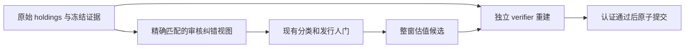
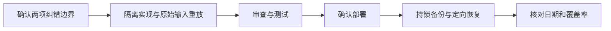

# Forward 两处证券源数据纠错方案

状态：Boss 已于2026-09-26确认；已部署并完成生产恢复。最终功能版本28b5761d；三指数历史和六篮子NTM通过认证，总请求1,119/1,200。恢复中另处理BNY财季标签、KRW范围和XLF精确期货分类，完整证据见docs/audit/2026-09-26-forward-source-corrections.md。

**Goal:** 用已核实的精确证券证据解除 SPY / SOXX 的两项身份阻塞。
**Architecture:** 在既有 holdings 规范化及身份验证之间添加范围严格的审核纠错视图。原始证券字段、原始 JSON、行数和权重保留；producer 与 verifier 独立重建有效分类/标识。不改变估值公式、权重门槛和逐篮子事务。
**Tech Stack:** Python、SQLite、现有 JSON 审核配置与 pytest。
**Spec:** 本文 R1–R5；既有 `docs/runbooks/index-pe-weekly-window.md`。
**北极星对齐:** `docs/design/north-star.md:67` 第一层数据层，原始证据与数据验证。

## 已核实证据

- SPY：DoubleLine 官方 CAPE 2026-07-31 holdings PDF 第7页把 `2602335D / 436CVR021 / TPG Inc / RIGHT` 同行绑定；ACVF 2026-09-24 holdings 把同一证券写作 `TPG INC - CVR`。SEC N-PORT 将 `436CVR021` 列为 Hologic 权利型衍生品。该行不能当作 TPG 普通股。
- SOXX：NXP 官方 FAQ 明确普通股 `CUSIP=N6596X109`、`ISIN=NL0009538784`。LSE 官方目录将 `0EDE` 绑定到 NXP ordinary shares。源记录的 `F2933A109` 是冲突值，不能登记成合法别名。
- 冻结文件与散列在 `docs/references/index-pe-source-corrections-20260926/`；SEC/LSE 浏览核实但未取得可用完整原文文件，实施验收前补存可重放证据。manifest 中失败抓取和 LSE 网页外壳不算完整证据。

来源：
- https://doubleline.com/wp-content/uploads/ETF-Website-Holdings-CAPE.pdf
- https://acvetfs.com/fund/acv-etf-fund-data/
- https://www.sec.gov/Archives/edgar/data/1860434/000141036826067310/xslFormNPORT-P_X01/primary_doc.xml
- https://www.nxp.com/company/about-nxp/investor-relations/investor-faqs:INVESTORS-FAQS
- https://www.londonstockexchange.com/exchange/instrument-result.html?filterBy=&filterClause=&initial=N&page=21

## 需要确认的处理边界

R1. SPY 这条 CVR 保留原始行及权重，按既有 derivative 规则排除普通股 PE，不能按“权重小”删除或映射到 TPG。
R2. SOXX 仅在完整精确条件匹配时，把有效 CUSIP 纠正为 `N6596X109`；raw CUSIP 仍为 `F2933A109`。任意不同冲突值继续拒绝。
R3. 审核记录包含 basket、source_kind=live、raw ticker/name、原始 CUSIP/ISIN、允许的缺失值、审核日、有效起止日和来源 SHA。仅审核实际留存的 9/25–9/26 输入范围；其他日期需明确扩展审核，不能靠无限期规则放行。
R4. 已存快照通过只读有效视图纠正；不覆盖旧 raw 字段，不删源行。新摄取和旧快照读取同样生效，防止“只修新数据，旧阻塞永远重现”。纠错 ID/理由显式进入运行证据。
R5. 既有方法仍为固定调仓权重 retrospective proxy；逐篮子原子认证、99.5%–100.5% raw weight 门槛、普通股成员数量门槛、PIT日期和精确冲突检查不放宽。

实施细化：纠错集中于 `src/data/security_source_corrections.py`，在新摄取进入内存后的统一读取点及旧快照读取时应用，不将运行时分类写回物理源。9/26已审核快照必须恰有一条匹配源行，防止删行/重复被跳过。PIT旧表缺CUSIP/ISIN，故仅对9/26通过完整源表的同日唯一见证，核对asset/name/weight/market_value/updated_at后应用分类；独立 `terminal/forward_source_verifier.py` 重建并验证该关联。历史缺见证的PIT周次不追溯改写。

## 架构与业务流程

## 替代方案与风险

- 等供应商修源：代码最少，但没有恢复时间；旧快照仍可能阻塞。
- 推荐精确审核纠错：能恢复，且可追溯；新增配置契约和独立验证工作。
- 单按 ticker、ISIN 或小权重跳过：容易把错误公司/证券放进估值，拒绝采用。

最大风险是纠错范围外溢，尤其普通 TPG/NXPI 或历史披露被误改。通过完整元组匹配、有限日期、证据散列、对每个条件逐项变异的负测试防止。分类先于股票池组装；原始权重汇总仍包含 CVR，不通过重新归一化隐藏输入缺损。

## 文件和任务

### Task 1 — 精确审核记录及源视图（R1–R4）

Files: 新建 `config/baskets/security_source_corrections.json`；修改 `src/data/fund_issuer_identity.py:53` 审核加载邻接路径、`src/data/fmp_forward_ingestion.py:597` 快照规范化、`scripts/backfill_index_pe_history.py:348` 已存快照读取路径；新增 `tests/test_security_source_corrections.py`。

接口：输入原始 snapshot row、审核记录、holding date；输出保留全部原始字段的 copy，以及 `effective_security` 与命中的 `correction_id`。无匹配不纠正，多个匹配/矛盾记录明确报错。canonical issuer key 仍由现有发行人证据确定。

1. 写失败测试：SPY exact tuple 输出 derivative、raw 字段/权重/行数逐字不变；SOXX exact tuple 输出 effective CUSIP，原 CUSIP 保留；所有匹配字段逐一变化、证据缺失、审核到期/重叠均不放行。用当前留存输入作 fixtures，不凭空猜字段。
2. 定点执行新测试，确认旧实现不能产生审核视图。
3. 实现两种有限 action（分类为 CVR derivative / CUSIP correction），接入新源与已存源读取；源权重质量门在完整原始集合上执行。
4. 测试通过，重放 SPY 普通 TPG、SPY NXPI、QQQ 和历史披露无改变；审计输出明确命中记录。
5. 提交独立 checkpoint。

### Task 2 — 独立认证与恢复预检（R4–R5）

Files: `scripts/verify_index_pe_history.py:949` 原始证券重建；`scripts/backfill_soxx_historical_pe.py:194` 权重与成员检查的回归测试；`tests/test_verify_index_pe_history.py`、`tests/test_index_pe_source_identity.py`、`tests/test_fmp_forward_ingestion.py`、`docs/runbooks/index-pe-weekly-window.md`。

接口：verifier 读取物理 raw rows 与审核配置，独立匹配和重建有效身份/分类，不能调用 producer 的纠错函数；证据配置验证可以共享。

1. 写失败测试：篡改有效 CUSIP/分类/原始字段、删除 CVR 行、取消原始权重均被拒绝；producer/verifier 独立得到相同有效证券集合。
2. 定点执行，确认旧 verifier 无法认证纠错后候选。
3. 实现独立重建；保持 raw-normalized 一致性检查，纠错只作用于有效视图。
4. 完整留存输入重放 + 受影响测试 + 全套测试，Python3.10语法检查；零HTTP离线验收先过。初次联网预检最多每篮子8次请求，预算到限不能宣称估值验收成功。
5. 提交 checkpoint，展示 diff 与证据；部署单独确认。恢复复用现有 runbook/共享writer锁和一致性备份，先估计缓存缺口与请求预算；不重跑已 complete ingestion，先SPY/SOXX历史恢复，再六篮子PIT与两个verifier。

## 验收标准

- 两处阻塞由精确证据解释；生产库 raw 行、raw identifier、权重不被改写或删除。
- 错误输入、缺证据、到期记录、其他篮子/日期/证券继续失败关闭。
- 每次估值记录使用了哪条纠错；独立 verifier 可从原始输入复现。
- 恢复后的窗口、最新日期、覆盖率、共识口径逐项报告；部分成功不报整体成功。
