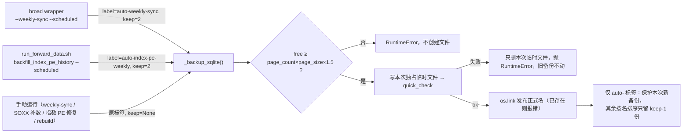
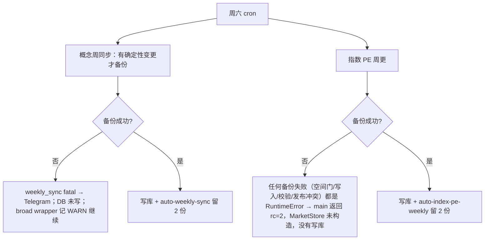

# M0 备份保留上限 + 磁盘空间门 Implementation Plan

**Goal:** 让云端定时任务生成的 SQLite 整库备份有保留上限、写前空间检查和原子发布，磁盘不再被备份悄悄写满；手动回滚点永远不被自动删。
**Architecture:** 共享函数 `_backup_sqlite()` 改为：按源连接的逻辑大小（含 WAL）做空间门 → 写本次独占的临时文件（`mkstemp`）→ `quick_check` → 不覆盖地发布正式名 → 仅对 `auto-` 标签按份数修剪；备份阶段的 I/O 与 SQLite 异常统一包装为带阶段与路径的 `RuntimeError`。定时入口显式加 `--scheduled`，这时才用 `auto-` 标签并传入保留份数；手动运行保持原标签，不修剪。空间门和 `quick_check` 对所有调用方一律生效，手动也不例外：空间不够时，手动修复同样会被拒绝（代码审查 #5 的澄清）。
**Tech Stack:** Python 3.10（云端）、sqlite3 backup API、pytest
**Spec:** 北极星 `docs/design/prosperity-engine-north-star.md` 第一层 P0 行 + 决策表"备份保留"；issue `docs/issues/046-cloud-market-db-weekly-backup-unbounded-retention.md`
**北极星对齐:** 第一层（数据前置）M0；上线前置条件，也对应 Pre-mortem"云端资源问题：磁盘写满"

## 已完成：一次性清理（2026-09-26，Boss 批准直接删除）

- 删除 27 个文件共 13,507,305,620 字节：3 份旧周备份、9/19 的 PE 备份、4 份手动修复前快照（含 9/12 PE 上线回滚点及其 shm/wal）、2 份扩池回填前快照、premium-repair 的库副本（JSON 证据保留）、`data/.backups` 下 10 个 guardian tar.gz、`/root/workspace/backups/finance` 下 7/13 的快照。
- 删除前确认所有文件都存在，`lsof` 显示没有进程占用。删除后 `df` 从 1.7G 可用（97%）变为 15G 可用（68%），在线 `market.db` quick_check=ok。
- 没动的：在线库；9/19、9/26 两份周备份；今天 forward 修复的回滚点（`…041749-pre-soxx-historical-pe`、`…083646….gz`、`pre-quality-recovery….gz`）；`Finance.bak.20260303`（issue079 依赖）；两份几 MB 的 dollar_volume 小备份。
- 北极星验收的第一半"空闲 ≥10G"已达成。第二半"下一次周六备份后份数仍不超上限"要靠下面的代码。
- 背景估算：按每个周六新增两份、各约 1.15G 计，原来的 1.7G 不够用。概念同步备份只在当周有确定性变更需要写库时才会生成，所以哪个周六写满不是确定的。

## 架构图



## 业务流程图



受管理备份的稳定状态：在线库 1 份 + `auto-weekly-sync` 2 份 + `auto-index-pe-weekly` 2 份，约 5.8G，随库大小增长。**这个数不含**保留的 `.gz`、手动回滚点、guardian 快照以及切换前的两份 `pre-weekly-sync`。

## 替代方案

| 方案 | 优点 | 缺点 | 结论 |
|---|---|---|---|
| A. 共享函数 + `--scheduled` 入口 + `auto-` 标签（选用） | 一处实现；手动与自动靠标签前缀区分，手动回滚点在构造上就不会被修剪 | 两个 CLI 各加一个开关，两个 cron 调用各改一行 | ✅ |
| B. 在调用点写死 keep（上一版） | 改动最少 | `open_write_dependencies()` 与 `--weekly-sync` 都有手动用法，同名标签无法区分自动与手动，会误删修复回滚点（审查 P1 #2） | ✗ |
| C. 单独的 cron 清理脚本 | 不碰业务代码 | 多一个 cron；和备份不同步，两次清理之间仍可能写满 | ✗ |

## 风险自证

- **误删回滚点**：只有带 `auto-` 前缀的标签才会被修剪；`keep` 配上非 `auto-` 标签直接报 `ValueError`。正则用 `re.escape(库名)`、`re.escape(label)`，精确匹配 `^{库名}\.backup-\d{14}-{label}$`，不碰 `.gz`、`.json`、`.partial` 和其他标签。本次新备份不参与候选，保证不会被删。所以现有的 `pre-*` 文件（包括 forward 修复的 041749）永远不会被自动删，部署时间不再依赖那次修复。
- **空间估算偏低**：WAL 里已提交的数据也会进入备份。实测主文件 4,096 字节、WAL 16.5MB，备份 16.4MB，而 `page_count×page_size` = 16.4MB。所以门槛基数改为源连接读到的 `page_count × page_size`。预检只能拦下明显不够的情况，写到一半磁盘满时靠 `.partial` 清理兜底。
- **残缺备份与并发**：用 `tempfile.mkstemp(dir=同目录, prefix=f"{final.name}.", suffix=".partial")` 创建本次调用独占的临时文件，两个同秒同标签的调用不会共用。备份写入并关闭连接、`quick_check` 通过后，再用 `os.link` 发布正式名，然后删除本次临时文件。发布是原子的，目标已存在时会失败，不会覆盖。异常时只删除本次创建的临时文件及其 `-journal`，别的调用的临时文件不动。
- **异常出口统一**：备份阶段（空间门、写入、校验、发布）的 `OSError`/`sqlite3.Error`，包括 `FileExistsError`、ENOSPC 和 `os.link` 失败，一律包装成 `RuntimeError(f"backup {phase} failed for {path}: {exc}") from exc`，保留原始异常链。这样 `backfill_index_pe_history.main` 现有的 `RuntimeError` 分支（`:639`）就能统一返回 2。修剪发生在备份已经发布之后，删除失败只记 `logger.error`、不抛出（代码审查 #2）：备份本身已经安全，不能因此跳过当周写库；万一旧文件删不掉导致空间变紧，由下次的空间门拦下。
- **空间门让当周任务跳过**：这是 Boss 选定的取舍。两个出口都已核实：`weekly_sync` 在 `build_company_concept_registry.py:1062` 捕获 fatal 并发 Telegram，这时备份在写库之前（`:1121`），DB 没被写；`backfill_index_pe_history.main`（`:629`）在打开 `MarketStore` 之前就先备份，失败时会被 `RuntimeError` 分支捕获，返回 2。
- **quick_check 成本与含义**：对 1.1GB 的备份多做一次只读检查，每周只有 1–2 次，代价可以接受。`quick_check=ok` 只说明文件结构完整，不保证业务数据正确。

## 验收标准

1. 本地：新增单测全部通过，`test_build_concept_registry.py`、`test_backfill_soxx_historical_pe.py` 以及指数 PE 相关测试文件全部通过。
2. 部署后首个自然周六，只读核查，**每类备份单独判定**：
   - 当天生成了 `auto-*` 备份的：新备份 `quick_check=ok`；日志中空间门的"需要/可用"字节数与 `page_count×page_size×1.5` 一致；修剪名单与预期一致；份数 ≤ 上限（周同步 2 / PE 2）。
   - 受保护文件（所有 `pre-*` 手动与遗留备份、`.gz`、`.json`）的名单、大小、mtime 与部署前快照一致。
   - 某类备份当天没有触发（例如概念同步没有变更）：记为"待验证"，顺延到下一次触发，不当作通过。
3. 部署前在云端临时目录用生产代码做一次空间门演练：用临时测试库，**mock** 可用空间，不去真的填满生产磁盘；Telegram 等通知通道换成测试记录器。确认 `backfill_index_pe_history` 返回 2、`MarketStore` 未构造；`weekly_sync` 走 fatal 分支且临时库行数不变。
4. `df` 可用空间 ≥ 10G。

## Global Constraints

- 空闲空间 ≥10G；下一次周六备份后份数仍 ≤2（北极星 P0 验收）
- 周备份留 2 份，手动快照清空，脚本加上限（北极星决策表 2026-09-26）
- Boss 2026-09-26：周同步备份留 2、PE 备份留 2（2026-09-26 Boss 按代码审查 #3 由 1 改为 2）；备份前空间不足（< 逻辑库大小 × 1.5）就拒绝
- 云端 Python 3.10；merge / push / 部署每步单独确认；worktree 开发，用主 `.venv`

---

### Task 1: `_backup_sqlite` 改为空间门 + 原子发布 + 受限修剪

**Files:**
- Modify: `scripts/build_company_concept_registry.py:1406-1429`（`_backup_sqlite`）
- Test: `tests/test_build_concept_registry.py`（接在 `:1029` 的现有 WAL 备份测试后面）

**Interfaces:**
```python
AUTO_BACKUP_PREFIX = "auto-"
def _backup_sqlite(db_path: Path, label: str, keep: int | None = None) -> Path | None
```
行为按顺序：
1. 库不存在 → 返回 None（原样）；`keep is not None` 但 `label` 不以 `auto-` 开头，或 `keep < 1` → `ValueError`
2. 打开源连接，`need = page_count * page_size * 1.5`；`shutil.disk_usage(parent).free < need` → `RuntimeError("insufficient disk for backup: free=… need=…")`，不创建任何文件
3. `final = {库名}.backup-{UTC 14 位}-{label}`；`final` 已存在 → 发布冲突
4. `mkstemp` 在同目录创建本次独占的临时文件 → 写入备份，关闭连接 → 在临时文件上跑 `PRAGMA quick_check`，结果不是 `ok` 就失败
5. `os.link(tmp, final)` 发布（目标已存在就失败），然后删除本次临时文件
6. 第 2–5 步和第 7 步的 `OSError`/`sqlite3.Error` 及校验失败，统一抛 `RuntimeError("backup <phase> failed for <path>: …") from exc`；失败时只删除本次临时文件及其 `-journal`（存在才删），旧备份和别的调用的临时文件一律不动
7. `keep is not None`：候选 = 目录中精确匹配 `^re.escape(库名)\.backup-\d{14}-re.escape(label)$` 且不等于 `final` 的文件，按名排序，删到只剩最新的 `keep-1` 份；每删一个记 `logger.info`

**TDD（每条先写、看它失败，再实现）：**
1. WAL 大小：`wal_autocheckpoint=0` 的临时库，主文件约 4KB、WAL 约 16MB；monkeypatch `disk_usage.free` 夹在"主文件 ×1.5"和"逻辑大小 ×1.5"之间 → 必须抛 `RuntimeError`，而且没有新文件。
2. 空间充足时正常备份，并且备份里能读到 WAL 中已提交的行（复用 `:1029` 的思路）。
3. 修剪：`auto-x` 标签预置 3 份旧备份，`keep=2` → 只剩本次新备份 + 最新 1 份旧备份。
4. 新备份保护：预置一份时间戳**大于**本次的同标签文件，`keep=1` → 本次新备份保留，那份未来时间戳的文件被删。
5. 同秒重试：monkeypatch 时间戳固定，连续调用两次 → 第二次抛 `RuntimeError`（`__cause__` 是 `FileExistsError`），第一份字节不变，本次临时文件没有残留。
5b. 临时文件隔离：预置一个模拟"另一个调用"的 `{final}.xxxx.partial`，本次调用失败（写入中途报错）后，那个文件字节不变。
6. 范围隔离：预置同库名的 `.gz`、`.json`、`pre-weekly-sync` 备份、另一个 `auto-y` 标签的备份、`market.db.before-x`、带正则元字符的库名（如 `m+k.db`）→ 修剪后都还在。
7. `keep` 配非 `auto-` 标签 → `ValueError`；`keep=None` 不删任何东西。
8. 写到一半失败：monkeypatch 让 `Connection.backup` 抛 `OSError(ENOSPC)` → 抛 `RuntimeError` 且 `__cause__` 为原始错误；本次临时文件没有残留，也没有 `final`；预置的旧备份字节不变。
9. quick_check 失败：monkeypatch 检查结果为非 ok → 抛 `RuntimeError`，没有 `final`，本次临时文件也没有残留。

然后跑整个 `tests/test_build_concept_registry.py` → commit。

### Task 2: 定时入口显式开启自动保留

**Files:**
- Modify: `scripts/build_company_concept_registry.py`
  - CLI（`:1660` 附近）加 `--scheduled`；`:1737` 把它传给 `weekly_sync(..., scheduled=False)` → `_weekly_sync_persist(..., scheduled)`
  - `:1121`：`scheduled` 时 `_backup_sqlite(db, "auto-weekly-sync", keep=2)`，否则保持 `_backup_sqlite(db, "pre-weekly-sync")`
- Modify: `scripts/backfill_soxx_historical_pe.py:299-302`：`open_write_dependencies(db_path, *, label="pre-soxx-historical-pe", keep=None)`；SOXX 手动入口 `:1115` 不改
- Modify: `scripts/backfill_index_pe_history.py`：加 `--scheduled`；`:629` 在 `scheduled` 时调用 `open_write_dependencies(args.db, label="auto-index-pe-weekly", keep=2)`，否则沿用默认值
- Modify: `scripts/broad_universe_cron_wrapper.sh:102` 加 `--scheduled`；`scripts/run_forward_data.sh:30` 加 `--scheduled`
- 不改：`pre-rebuild`（`:594`、`:1459`）

**Tests:**
- `tests/test_backfill_soxx_historical_pe.py:236`：默认调用断言 `label="pre-soxx-historical-pe"`、`keep=None`
- 指数 PE：`--scheduled` → `auto-index-pe-weekly`/`keep=2`；不带 → 默认值。用真实 `_backup_sqlite` 分别注入空间不足、中途 ENOSPC、发布冲突三种失败 → `main` 都返回 2，`MarketStore` 都没被构造
- 概念同步：`scheduled=True` → `auto-weekly-sync`/`keep=2`；默认 → `pre-weekly-sync`/`keep=None`；备份抛错时 `res.error` 有值，`save_to_market_db` 没被调用
- 两个 shell 脚本：`grep` 断言调用行带 `--scheduled`（照现有 shell 测试的做法；没有就用 `bash -n` 加文本断言）

**TDD:** 先写断言（此时应失败），实现，跑相关测试文件全部通过 → commit。

### Task 3: 审查、文档、发布（每步单独确认）

1. `/code-review high` 审 diff，核实反馈后再改。
2. 跑完整测试套件，贴结果；已知的历史失败单独列出，不算本次引入。
3. 文档：issue046 追加"2026-09-26 自动保留已实现"段；`ARCHITECTURE.md` 如有备份说明一并更新；北极星 M0 行在验收标准 2 的两类备份都判定通过后才改成 ✅。
4. 三件事分别等 Boss 点头：merge、push、云端部署。部署避开周六 09:00–16:00 的写库窗口，部署前还要现场核实活跃进程（`ps` 和 writer 锁），确认没有 Finance 写库任务在跑；部署前拍下受保护文件快照（名单、大小、mtime），并做验收标准 3 的演练。
5. 遗留：切换后 `pre-weekly-sync` 不会再生成新文件，9/19、9/26 两份不会被自动删。等到 2 份 `auto-weekly-sync` 都生成后，列清单请 Boss 决定是否手动删除。
6. 首个自然周六后按验收标准 2 只读核查，结果（含"待验证"项）写进 issue046。

## 评审修订记录（2026-09-26）

| # | 意见 | 处理 |
|---|---|---|
| P1-1 | 空间估算漏了 WAL | 接受，已在 scratchpad 复现（主文件 4KB / WAL 16.5MB / 备份 16.4MB = page_count×page_size）。基数改为逻辑大小，加 Task 1 测试 1、8 |
| P1-2 | PE 调用点有手动用法，同名标签分不清 | 接受，并推广到 `--weekly-sync`（同样有手动用法）。定时入口显式 `--scheduled` + `auto-` 标签；非 `auto-` 标签在构造上就不能修剪 |
| P2-3 | 失败残留没有处理契约 | 接受：`.partial` → quick_check → `os.link` 发布 → 异常清理；加测试 8、9 |
| P2-4 | 新备份保护、同秒重试、正则转义 | 接受：本次新备份不参与候选，目标已存在就报错，`re.escape`；加测试 4、5、6 |
| P2-5 | 验收不应比较业务 rc | 接受：改为逐类检查备份行为，没触发就记"待验证"，并加部署前空间门演练 |
| 口径 | 4.6G 范围；"10/3 必满" | 接受：4.6G 只指受管理备份；写满时间改为按估算表述 |
| 二轮 P2-1 | 固定 `.partial` 名会在并发调用之间串扰 | 接受：`mkstemp` 独占临时文件，只清理本次的；加测试 5b |
| 二轮 P2-2 | `OSError` 类失败没被 main 捕获 | 接受：备份阶段统一包装为 `RuntimeError`（from exc），三种失败都测 rc=2 |
| 二轮措辞 | 演练用 mock；quick_check 含义；部署前核实进程 | 接受，已写入验收标准 3、风险自证、Task 3 |
| 代码审查 high | 10 条 | #1 超过 24 小时的同标签孤儿临时文件在修剪时清理；#2 修剪失败只记日志；#4 发布成功后临时文件删不掉只记警告；#6 未来时间戳文件不占保留名额；#7 发布出去的备份权限为 0644；#8 目标已存在时在复制之前就拒绝；#10 测试辅助函数去重；#5 只改文档；#9（搬到 `src/data/`）不在本次范围；#3 Boss 决定 PE 改为留 2 份 |
