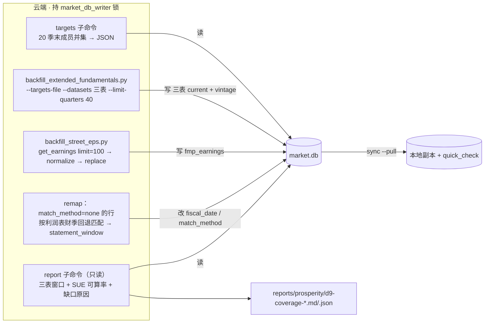
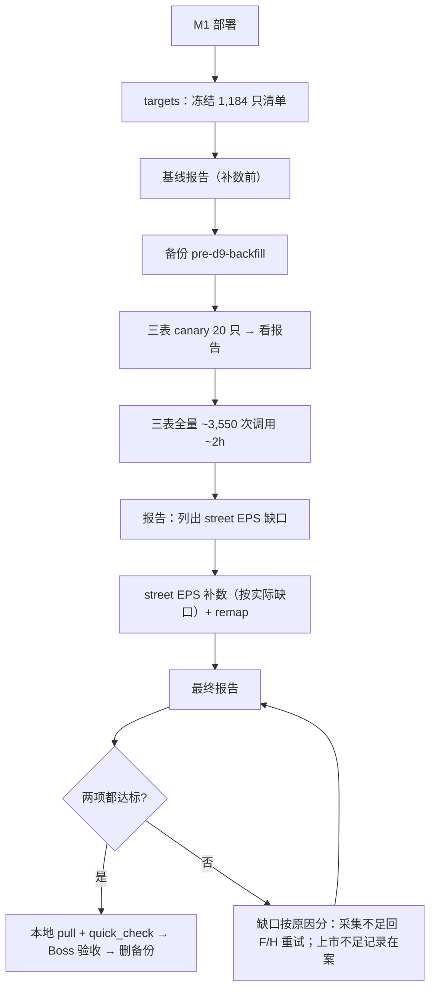

# 景气引擎 M2：D9 历史补数与验收 Implementation Plan

**Goal:** 把 2021-09 → 2026-06 共 20 个季末的 $10B+ 历史成员（M1 修复后 1,184 只）补齐三表 40 季和 street EPS，并出一份"三表 + street EPS"两部分的覆盖率报告，作为景气引擎所有历史榜单的数据地基。
**Architecture:** 不写新采集器。三表复用 `scripts/backfill_extended_fundamentals.py`（锁、断点续跑清单、熔断），只加"外部冻结目标清单"和"只采三表"两个参数；street EPS 复用 `FMPClient.get_earnings` + `normalize_earnings` + `replace_fmp_earnings`，套一层薄 wrapper；验收是只读脚本。所有写入在云端、拿 `market_db_writer` 锁。
**Tech Stack:** Python 3.10（云端）、SQLite、pytest、现有 FMP client
**Spec:** `docs/design/prosperity-engine-north-star.md` 第一层 A 段 P2/P3
**北极星对齐:** 第一层数据层 · 前置任务 P2（D9 补数）+ P3（验收）；需求 R2、R4、R13、R14
**依赖:** M1（`prosperity/m1-membership-fix`，cef10973）先 merge 并部署到云端，目标清单要用修复后的成员函数

## 架构图



## 业务流程图



## 替代方案

| 方案 | 优点 | 缺点 | 结论 |
|---|---|---|---|
| A. 冻结并集清单一次跑（选定，Boss 2026-09-27 拍板） | 一个 run_id、一次断点续跑、调用最少 | 要给脚本加 `--targets-file` | ✓ |
| B. 现有历史模式逐季末跑 20 次 | 不改代码 | 20 个 run_id，同一只票可能被重复拉；每次判断缺口的开销 | ✗ |
| C. 写专用采集器 | 可以定制 | 违反"复用已验证逻辑"；重复写锁、熔断、清单 | ✗ |

**只采三表（新建议，待 Boss 确认）**：现有内核默认采 profile / 三表 / ratios 五类。景气引擎只用三表；profile 会把约 400 只已退市公司写进 `profiles.json` 镜像（晨报元数据缓存、`data_health` 覆盖率、暴露分析会读它），ratios 固定只拉 4 季，对历史没用。只采三表可以省约 40% 调用（约 5,900 → 3,550 次，约 3.5h → 2.1h），同时避开镜像污染。

## 风险自证

- **最大风险：补进来的历史被周六例行刷新冲掉。** 已核实：三表写入没有 `DELETE`，按 (symbol, date) 覆盖更新；周六拉 8 季只会刷新最近 8 季。`replace_fmp_earnings` 只删 `eps_actual IS NULL` 的预排行，并且保留已有的非空财季映射。
- **第二风险：street EPS 财季对不上。** 云端现有 `fmp_earnings` 中 16,321 行（1,024 只）`match_method='none'`（2026-09-27 只读查询），主要是早于一致预期覆盖期的老公告。按 Boss 拍板，用已入库利润表的财季日期回退匹配，规则同 `match_fiscal_date`（财季末 < 公告日且间隔 ≤120 天，取最近），标 `statement_window`。`terminal/forward_valuation.py:188` 只认 `estimates_window`，指数 PE 口径不受影响。
- **第三风险：磁盘与锁。** 预计 +200MB，云端现空闲 16G。持锁约 2–3 小时，选工作日白天，避开 06:30 / 08:00 / 周六窗口；锁忙时退出 75，不会半途卡住别的任务。
- **为什么不更简单：** 不能只补当前成员（会带入幸存者偏差，R4）；不能不做 P3（北极星把 SUE 深度列为验收项，缺了第二层因子就算不出）。

## 验收标准（Boss 不看代码也能判断）

1. **三表**：20 个季末里每一个季末，身份合规成员中 ≥95% 在当日有 ≥8 季连续三表。
2. **street EPS**：报告逐季末给出 SUE 可计算率（截至当日已公告、已映射财季、连续 ≥11 季；完整窗口 13 季；ΔSUE 再多 1 季），并列出映射率、同财季重复、拆股口径可疑名单。北极星没给这一项的数值门槛，**由 Boss 看报告拍板**。
3. **缺口**：两项的缺口都逐只列原因，分成"上市历史本来不足"与"采集不足 / `provider_empty` / 失败"两类；后一类要么补上，要么写明为什么补不上。
4. **数据完整**：云端补数后 `PRAGMA quick_check` = ok；本地 `./sync_to_cloud.sh --pull` 后 quick_check = ok（顺带修好当前损坏的本地副本）。
5. **冻结参数复核**：用补完的数据复算"季末后第 60 天覆盖率 / 95% / 第 80 天"三个数，写进报告。

## Global Constraints

- `market.db` 云端独占写入，本地只读副本；研究产物不写本地 `market.db`
- API 调用串行，间隔由 client 控制；FMP 按调用计费，40 季与 32 季成本相同
- 写库任务共用 `market_db_writer` 锁，锁忙退出 75
- 可用时点：三表统一用 `accepted_date`（缺失退回 `filing_date`）
- 不给 `fmp_earnings` 加版本表；不改 `market.db` 已有行的原始值（remap 只补空缺的财季映射）
- 执行前 merge、push、部署、生产写入每一步都停下来等 Boss 确认

## 文件结构

| 文件 | 动作 | 职责 |
|---|---|---|
| `scripts/backfill_extended_fundamentals.py` | 改 | 加 `--targets-file`、`--datasets` |
| `src/data/prosperity_history.py` | 新 | 纯逻辑：季末列表、成员并集、street EPS 深度判定、缺口原因分类、利润表回退匹配 |
| `scripts/verify_prosperity_history.py` | 新 | `targets` 子命令（冻结清单）+ `report` 子命令（只读覆盖率报告） |
| `scripts/backfill_street_eps.py` | 新 | 薄 wrapper：按清单拉 earnings、写库、remap；拿锁；熔断 |
| `src/data/market_store.py` | 改 | 加 `remap_unmatched_earnings(symbol, fiscal_dates)`：只改 `match_method='none'` 的行 |
| `tests/test_backfill_targets_file.py`、`tests/test_prosperity_history.py`、`tests/test_backfill_street_eps.py` | 新 | 对应测试 |
| `docs/runbooks/prosperity-d9-backfill.md` | 新 | 执行顺序、命令、回滚 |

---

### Task 1: 补数脚本支持外部冻结清单与只采三表

**Files:** Modify `scripts/backfill_extended_fundamentals.py`（`_resolve_targets` 约 :336、`run_backfill` :376、`_drive` 建网格处 :440-443、`parse_args` :612）；Test `tests/test_backfill_targets_file.py`

**Interfaces:**
- Produces: CLI `--targets-file PATH`（JSON `{"symbols": [...], "source": ..., "as_of_dates": [...]}`）、`--datasets income,balance,cashflow`；`run_backfill(..., targets_override: Optional[List[str]] = None, datasets: Sequence[str] = DATASETS)`
- 规则：`--targets-file` 与 `--include-historical` 互斥；空清单退出 2；`--resume` 仍以 manifest 为准；`datasets` 不含 `profile` 时跳过 `profiles.json` 镜像刷新；未知 dataset 在参数校验时报错

- [ ] Step 1: 写失败测试
```python
def test_targets_file_freezes_exact_symbols(tmp_store, fake_client, null_lock, tmp_path):
    f = tmp_path / "t.json"; f.write_text(json.dumps({"symbols": ["ABC", "COR"]}))
    rc = run_backfill(run_id="r1", store=tmp_store, client=fake_client, lock=null_lock,
                      targets_override=load_targets_file(f),
                      datasets=("income", "balance", "cashflow"), limit_quarters=40)
    assert rc == 0
    jobs = tmp_store._get_conn().execute(
        "select symbol, dataset from fundamental_backfill_jobs where run_id='r1'").fetchall()
    assert {(r[0], r[1]) for r in jobs} == {(s, d) for s in ("ABC", "COR")
                                            for d in ("income", "balance", "cashflow")}
    assert fake_client.limits == {40}

def test_targets_file_rejects_empty_and_historical_combo(tmp_path):
    f = tmp_path / "t.json"; f.write_text(json.dumps({"symbols": []}))
    with pytest.raises(SystemExit):
        parse_args(["--run-id", "x", "--targets-file", str(f), "--include-historical",
                    "--as-of", "2024-06-30"])
    with pytest.raises(ValueError):
        load_targets_file(f)

def test_statements_only_skips_profile_mirror(tmp_store, fake_client, null_lock, tmp_path):
    mirror = tmp_path / "profiles.json"
    run_backfill(run_id="r2", store=tmp_store, client=fake_client, lock=null_lock,
                 targets_override=["ABC"], datasets=("income",),
                 profiles_mirror_path=mirror)
    assert not mirror.exists()
```
（`fake_client` / `null_lock` 复用现有 `tests/test_backfill_extended_fundamentals.py` 的夹具写法，fake client 记录收到的 `limit`。）
- [ ] Step 2: `pytest tests/test_backfill_targets_file.py -v` → FAIL（参数不存在）
- [ ] Step 3: 实现：`load_targets_file()` 校验非空、去重、大写；`_resolve_targets` 在 `targets_override` 给定且非 resume 时直接返回；网格与 `params` 用 `datasets`；`params` 里记 `targets_file` 的 sha256 便于审计
- [ ] Step 4: 该文件测试 + `tests/test_backfill_extended_fundamentals.py` 全部 PASS
- [ ] Step 5: `git commit -m "feat(backfill): frozen targets file and dataset subset"`

### Task 2: 历史成员并集与目标清单（`targets` 子命令）

**Files:** Create `src/data/prosperity_history.py`、`scripts/verify_prosperity_history.py`；Test `tests/test_prosperity_history.py`

**Interfaces:**
- Consumes: `MarketStore.approximate_members_as_of(as_of)`（M1 版，默认读别名配置、10 天窗口）
- Produces: `quarter_ends(start="2021-09-30", end="2026-06-30") -> List[str]`；`members_by_quarter_end(store, qes) -> Dict[str, List[str]]`；CLI `verify_prosperity_history.py targets --out data/prosperity/d9_targets.json`（只读 `MarketStore(read_only=True)`），输出 `{"symbols", "by_quarter_end", "aliases_applied", "generated_at", "code_sha"}`

- [ ] Step 1: 失败测试
```python
def test_quarter_ends_span():
    q = quarter_ends("2021-09-30", "2026-06-30")
    assert q[0] == "2021-09-30" and q[-1] == "2026-06-30" and len(q) == 20

def test_members_union_uses_canonical_codes(tmp_store):
    seed_hmcap(tmp_store, "ABC", "2022-06-30", 30e9)
    seed_hmcap(tmp_store, "COR", "2024-06-28", 40e9)
    by_qe = members_by_quarter_end(tmp_store, ["2022-06-30", "2024-06-30"],
                                   aliases=[RENAME_ABC_COR])
    assert by_qe == {"2022-06-30": ["COR"], "2024-06-30": ["COR"]}
```
- [ ] Step 2: FAIL（模块不存在）
- [ ] Step 3: 实现（`members_by_quarter_end` 透传 `aliases`，默认 None 走配置）
- [ ] Step 4: PASS
- [ ] Step 5: `git commit -m "feat(prosperity): as-of member union and D9 target freezer"`

### Task 3: street EPS 深度判定与缺口原因（报告的纯逻辑）

**Files:** Modify `src/data/prosperity_history.py`；Test `tests/test_prosperity_history.py`

**Interfaces:**
- Produces:
  - `three_table_ok(store, symbol, as_of) -> bool`：直接调用 `scripts/backfill_extended_fundamentals.has_asof_window`（不复制逻辑）
  - `street_eps_depth(rows, as_of) -> Dict`：输入该票 `fmp_earnings` 行，只看 `announce_date <= as_of` 且 `fiscal_date` 非空且 `eps_actual` 非空的行；从最新财季往回数连续季度（相邻财季间隔 ≤ `FUNDAMENTAL_QUARTER_GAP_MAX_DAYS`）；返回 `{"consecutive": n, "sue_ok": n >= 11, "sue_full": n >= 13, "dsue_ok": n >= 12, "mapped_ratio", "dup_fiscal": [...]}`
  - `split_suspects(eps_rows, splits, as_of) -> List[Dict]`：窗口内有拆股、且拆股前后相邻 EPS 比值接近拆股倍数（±15%）时列出，只报告不判错
  - `gap_reason(symbol, statement_dates, job_status, requested_quarters) -> str`：`short_history`（供应商返回的季度少于请求数且最早一季晚于所需窗口起点，即公司本来没有那么长的历史）/ `provider_empty` / `fetch_failed` / `not_attempted` / `gap_in_series`
- [ ] Step 1: 失败测试（每个函数至少一正一反：连续 13 季 → sue_full；中间断一季 → consecutive 只数到断点；同财季两行 → dup_fiscal；2:1 拆股前后 EPS 比 ≈2 → 入 suspects；供应商给 22 季且最早 2021-03 → short_history；job 状态 fetch_failed → fetch_failed）
- [ ] Step 2: FAIL
- [ ] Step 3: 实现
- [ ] Step 4: PASS
- [ ] Step 5: `git commit -m "feat(prosperity): street EPS depth, split suspects, gap reasons"`

### Task 4: 覆盖率报告（`report` 子命令，只读）

**Files:** Modify `scripts/verify_prosperity_history.py`；Test `tests/test_prosperity_history.py`

**Interfaces:**
- Consumes: Task 2 的 targets JSON、Task 3 全部函数、`fundamental_backfill_jobs`（取 job 状态）
- Produces: `report --targets data/prosperity/d9_targets.json --run-id <id> --out-dir reports/prosperity/`，写 `d9-coverage-<date>.json` + `.md`。内容：逐季末三表合格率（分母 = 该季末身份合规成员）、SUE 可算率 / 完整窗口率 / ΔSUE 可算率、映射来源占比（`estimates_window` / `statement_window` / none）、缺口逐只原因、拆股可疑与同财季重复清单、冻结参数复核（逐季末：季末后第 60 天与第 80 天时"当前财季已到达该季"的成员比例）；以及北极星门槛（三表 ≥95%）逐季末 PASS/FAIL
- 退出码：三表门槛全部 PASS → 0，否则 1（street EPS 无数值门槛，不影响退出码，报告里显式写"待 Boss 定"）
- [ ] Step 1: 失败测试：两只票、两个季末的小夹具，断言 JSON 各字段数值与门槛判断；三表不达标时退出码为 1
- [ ] Step 2: FAIL
- [ ] Step 3: 实现（`MarketStore(read_only=True)`，不写库）
- [ ] Step 4: PASS
- [ ] Step 5: `git commit -m "feat(prosperity): D9 coverage report (three tables + street EPS)"`

### Task 5: street EPS 补数 wrapper 与利润表回退匹配

**Files:** Create `scripts/backfill_street_eps.py`；Modify `src/data/market_store.py`（在 `replace_fmp_earnings` 旁加 `remap_unmatched_earnings`）、`src/data/prosperity_history.py`（`statement_fiscal_dates(store, symbol)`）；Test `tests/test_backfill_street_eps.py`

**Interfaces:**
- Consumes: `FMPClient.get_earnings(symbol, limit=100)`、`normalize_earnings(symbol, raw, fiscal_dates)`、`match_fiscal_date`、`replace_fmp_earnings`、Task 1 的 `load_targets_file`、锁用 `FileLock`（同一个 `market_db_writer`）
- Produces:
  - `MarketStore.remap_unmatched_earnings(symbol, fiscal_dates) -> int`：只更新 `match_method='none' AND fiscal_date IS NULL` 的行，用 `match_fiscal_date(announce, fiscal_dates)` 找财季，命中写 `fiscal_date` + `match_method='statement_window'`；已有映射的行一行不碰；返回改动行数
  - CLI `backfill_street_eps.py --targets-file F [--remap-only] [--dry-run]`：对每只票，一致预期财季取 `fmp_estimates` 已有的季度财季（不新拉预期），`get_earnings` → `normalize_earnings` → `replace_fmp_earnings` → `remap_unmatched_earnings(利润表财季)`；`--remap-only` 不调 API、只做 remap；已处理的票记在 `data/prosperity/street_eps_progress.json`，断点续跑；处理满 50 只后失败率 >20% 熔断退出 1；锁忙退出 75
- [ ] Step 1: 失败测试
```python
def test_remap_only_touches_unmatched(tmp_store):
    tmp_store.replace_fmp_earnings("ABC", [
        {"announce_date": "2019-02-01", "fiscal_date": None, "match_method": "none", "eps_actual": 1.0},
        {"announce_date": "2025-02-01", "fiscal_date": "2024-12-31",
         "match_method": "estimates_window", "eps_actual": 2.0}])
    n = tmp_store.remap_unmatched_earnings("ABC", ["2018-12-31", "2024-12-28"])
    rows = {r["announce_date"]: r for r in tmp_store.get_fmp_earnings("ABC")}
    assert n == 1
    assert rows["2019-02-01"]["fiscal_date"] == "2018-12-31"
    assert rows["2019-02-01"]["match_method"] == "statement_window"
    assert rows["2025-02-01"]["fiscal_date"] == "2024-12-31"      # untouched

def test_remap_respects_120_day_rule(tmp_store):
    tmp_store.replace_fmp_earnings("ABC", [
        {"announce_date": "2019-08-01", "fiscal_date": None, "match_method": "none", "eps_actual": 1.0}])
    assert tmp_store.remap_unmatched_earnings("ABC", ["2019-03-31"]) == 0   # 123 days

def test_wrapper_breaker_and_lock(tmp_store, failing_client, busy_lock, tmp_path):
    ...  # 60 只全部 get_earnings 抛错 → rc 1 且进度文件只记失败；busy_lock → rc 75 且不写库
```
- [ ] Step 2: FAIL
- [ ] Step 3: 实现
- [ ] Step 4: PASS，并跑 `tests/test_fmp_forward*.py` 确认周更链路不受影响
- [ ] Step 5: `git commit -m "feat(prosperity): street EPS backfill wrapper and statement-window remap"`

### Task 6: 运行手册 + 云端执行（每个写库步骤前停下等 Boss 确认）

**Files:** Create `docs/runbooks/prosperity-d9-backfill.md`

1. merge / push / 云端 `git pull`（M1 与 M2 分支，各自确认）
2. 只读：`verify_prosperity_history.py targets` → 清单只数应为 1,184 左右；`report` 出**补数前基线**
3. 备份：用现有备份脚本打 `pre-d9-backfill` 标签（手动标签，不参与自动修剪；验收后经 Boss 确认删除）
4. 三表 canary：`backfill_extended_fundamentals.py --run-id d9-20260928 --targets-file data/prosperity/d9_targets.json --datasets income,balance,cashflow --limit-quarters 40 --canary 20`，看 manifest 与 20 只的 40 季是否落库、vintage 是否只追加
5. 三表全量：**新 run_id** `d9-full-*`（canary 已把 20 只冻结进自己的清单，同 run_id `--resume` 只会续跑那 20 只；执行中发现并修正）（约 3,550 次调用，约 2 小时）；中断就原命令加 `--resume` 续跑
6. （执行细节以 `docs/runbooks/prosperity-d9-backfill.md` 为准：缺口清单在 remap 之后冻结一次、不可覆盖）`report` → 取 street EPS 缺口名单（没有 earnings 行的 + 深度不足 / 映射缺失的）写成第二份清单
7. `backfill_street_eps.py --remap-only`（全量 1,184 只，不调 API）→ 再 `report`，看 remap 补上多少
8. `backfill_street_eps.py --targets-file <缺口清单>`（预计 ≤400 次调用）→ 最终 `report`
9. 云端 quick_check；本地 `./sync_to_cloud.sh --pull` + quick_check
10. 结果写进 issue / audit，并更新北极星"各层完成度"与冻结参数复核值

**回滚**：三表与 earnings 都是按主键覆盖更新、vintage 只追加。异常时用 `pre-d9-backfill` 备份整库恢复（恢复前停 cron 写入，按 M0 的原子发布方式换文件）。

## 自审

1. **spec 覆盖**：P2 三表 40 季 → T1+T6；P2 earnings 按实际缺口补 → T5+T6 第 6–8 步；P3 三表 ≥95% → T4；P3 street EPS 深度 / 映射 / 重复 / 拆股 / SUE 可算率 → T3+T4；原因分两类 → T3 `gap_reason`；本地重拉 + quick_check → T6 第 9 步；复核 60 / 95% / 80 → T4。均有对应。
2. **占位符**：T5 的第三个测试只写了"…"，执行时按括号里的场景写全（busy lock → 75 不写库；50 只后失败率 >20% → 1）。其余无 TBD。
3. **类型一致**：`load_targets_file` T1 定义、T5 使用；`has_asof_window` 签名 `(store, symbol, as_of, quarters=8)` 与现有代码一致；`approximate_members_as_of` 用 M1 签名。

**待 Boss 确认的新增点**：①只采三表（不采 profile / ratios）；②street EPS 没有数值门槛，看完报告再定；③T6 第 7 步的 remap 会改写现有约 16,000 行 `none` 行里能匹配上的那部分（只补空缺的财季映射，不动数值）。

执行：默认主线程 inline，每个任务一个 checkpoint；不开 subagent。
