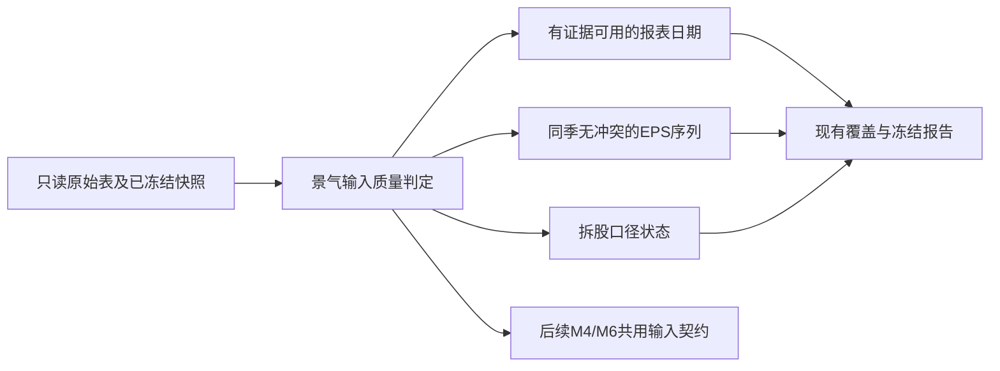
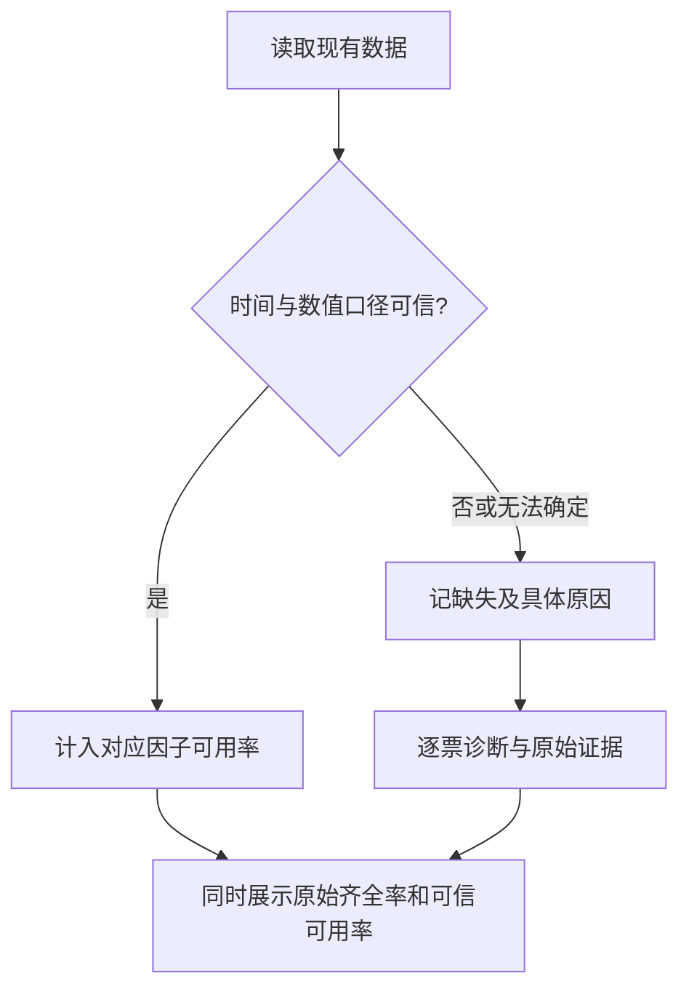

# 景气 M3/M4：三项数据质量阻断修复计划

**Goal:** 阻止部分拆股回溯、占位可用日期、冲突财季EPS进入景气因子计算及“可用”覆盖率。
**Architecture:** 在景气只读输入层增加三个纯函数判定，并接入现有D9报告。保留原始表和失败manifest；不自动调整EPS、不把EPS公告日当三表发布日期。共用既有日期匹配与连续窗口内核，不另起采集系统。
**Tech Stack:** Python3.10、SQLite只读、pytest；隔离临时库与已冻结快照。
**Spec:** docs/design/prosperity-engine-north-star.md 第一层B、第二层；CC验收交接 docs/handoffs/2026-09-29-prosperity-data-readiness.md 第7节。
**北极星对齐:** M3打分字段硬错误检查、M4点时输入边界；R2/R13/R14。本计划不是全部M4或M6实现。
**状态:** Boss已批准实施；已根据下降归因修订为“历史回放”和“已观测当前输入”分开验收，先前单一覆盖率表述不再适用。开发分支codex/prosperity-quality-guards，基于fea08a09；仅本地worktree。

## 2026-09-29 Boss最新优先级（覆盖前述历史收口优先级）

Boss明确：重点是未来的数据持续具备，过去缺数据不是大问题。执行主线改为当前候选及后续周更输入质量；历史日期/覆盖不足明确标注并允许留缺，不为补齐历史延迟当前工具。

- 三项保护仍要解决，因为未来供应商更新也会出现局部拆股回溯、占位日期及冲突EPS。保护当前实际使用的窗口，异常仅影响对应因子，不能静默抄值/补0。
- 当前输入采用有证据的归档观测时间，历史公开日期与观测时间分开；历史未知不直接剔除当前股票。
- 从现在起留存每次实际用于榜单的输入及观测时间，复用北极星M8已规定的输入存档；本次不另建全库历史版本系统。
- 历史报告用于披露问题和比较，不把2021–2026每期时间证据齐全作为当前开发或发布的新门槛。原始历史范围和旧报告保留，历史缺失不伪造。
- 后续验收主指标应是“当前候选输入是否可信、下次周更能否稳定保留”，历史覆盖率变化不单独驱动再补数。

## 已复现证据与重要影响

源快照SHA：3caffdb7e7c2d2d9c5124fcbf364e46cf32d51307dde3d9ea49bf8ecf54800e2。
证据在主仓库reports/prosperity/quality-guards-2026-09-29/read-only-evidence.json（SHA70e04498629e1e8c459beb6b251e70c167938f8ad7c435395b9ed8e2a54ddf1d）。

- KLAC：street EPS在2024Q2的6.60到Q3的0.733切换，拆股记录却在2026-06；对应GAAP EPS已统一为0.618/0.701量级。
- ANET：street EPS在2024Q2的2.10到Q3的0.60切换；4:1拆股发生在2024-12，GAAP历史已统一。
- ORLY：street EPS在2024Q3的11.41到Q4的0.66切换；15:1拆股发生在2025-06。
- BHP的2023-12-31财季accepted=2023-12-30；FER多期两项日期都等于财季末。
- BHP同季度1.34/0.36/0.3651；FER0.4415/0.883；COIN3.39/4.66，不能靠“公告日期最新”判断哪一个street口径正确。

**下降归因与场景修订：** 用现有连续窗口定义，八季每表都必须具有可信公开日期的“历史回放时间证据覆盖率”预演为2021-09 **75.51%**、2026-06 **81.99%**，20期均低于90%。2026-06旧886只→新765只，122只失去通过、HDB新增通过，净少121只；其中96只最新一季三表日期可信，仅历史窗口中的旧日期未知；26只最新季也存在日期问题。详见timestamp-loss-attribution.json。

这不是当下筛股可用率，也不能据此直接剔除96只当前候选。必须分开：

- 历史回放：按目标历史as_of证明当时已公开，未知日期不能当时可用；继续如实报告该覆盖率下落，保持approximate标注。
- 已观测当前输入：只在有可信归档观测时间且as_of不早于该时间时，允许用这份快照内已存在的历史数值。observed_at是“最迟已知”的上界，不伪造原始发布日期；三表连续深度、拆股及EPS冲突等数值检查仍必须通过。
- 使用2026-09-29观测快照，不能冒充已证明2026-09-26或6/30当时可得。当前榜是否可用要在正确截止日重新测量，不能沿用CC 9/26或旧6/30数字替代。

旧报告保留为原始齐全率对账；新报告明确同时给出历史时间证据覆盖与当前观测输入覆盖，不共用一个含糊的“可信覆盖率”。

## 架构图



## 业务流程图



## 替代方案

1. **推荐：读取层拦截。** 原始值不动，问题影响到的因子缺失；可立即阻止错误打分，代价是可信覆盖率降低。
2. **自动补日期/按拆股倍数改EPS/选最新公告。** 表面覆盖率高，但会混用GAAP与street或制造前视，拒绝采用。
3. **逐票逐期查发行人资料后人工修复。** 证据更强、能挽回可用因子，但扩大取证和写库范围；作为后续明确授权的小批修复，不在本次自动执行。

## 拟批准的规则

### A. 可用时点

- 按表分别校验日期，合法且严格晚于财季末的accepted_date优先；否则可退到同表合法且晚于财季末的filing_date，显式记录fallback原因。
- 两个日期均占位/非法/缺失：available_at=None，reason=statement_availability_unknown；历史as_of读排除，不拿EPS公告日或固定45/90天猜填。
- 有有效日期但晚于as_of：正常未到达，不算数据错误；三表当前财季和季末到达均以三表共同可用为准。
- 可信观测时间只能证明该观测时点及之后已知；不把2026-09快照信息回填为2021年已知。读取模式显式区分historical_public与observed_snapshot，后者必须提供归档manifest中的snapshot_observed_at并验证as_of≥该时间，禁止默认使用程序当前时间为旧数据补证据。本轮不实现完整vintage读取器，历史报告仍为approximate。

### B. 同一财季EPS冲突

- 先按as_of过滤公告，再按既有±20天财季容差分组；禁止链式分组把跨度超过20天的日期硬合成一季。
- EPS一致（只容忍浮点误差rel_tol=1e-9/abs_tol=1e-12）的重复可折叠，保留所有来源标识及最早已知公告日。
- EPS不一致：该季度无可用值，reason=eps_conflicting_quarter；不选最新、不平均、不从GAAP抄值。
- SUE/ΔSUE使用的季度窗口触及冲突则对应结果记缺失；不能删掉冲突季度再往更早历史补足窗口。窗口之外的旧冲突只诊断，不永久封禁股票。
- 质量异常与序列本身zero_sigma分开，不能把前者报成“不可补的sue_degenerate”。不因一个EPS因子坏而直接剔除整只股票。

### C. 拆股回溯不一致

- 扫描整个所需历史窗口，不只看拆股日相邻两季。结合已知拆股倍数和同财季street/GAAP每股量纲比例的分段变化做疑似判定；GAAP仅为旁证，绝不代替street值。
- 可测初始判据：候选断点紧邻两侧各3个同财季配对观测；每侧每个比例相对该侧中位数偏差≤35%，两侧中位比例之比与已知拆股倍数或倒数相差≤25%。输出断点、所用季度、倍数和比例，状态仅为suspect。
- 原拆股日前后相邻季比值提示保留为warning；单纯EPS突然涨跌不直接判定拆股污染。
- 需要跨越疑似口径边界才能计算的SUE/ΔSUE记eps_split_basis_suspect；不自动乘除拆股倍数，不误伤只依赖边界同侧的计算。短序列或缺拆股/GAAP旁证应标检查能力不足，不能称已通过拆股验证。
- 历史当前表是事后重述数据：用快照所知拆股元数据诊断其单位一致性属于事后质量检查，必须显式标记，不称严格as-of可得；不用未来数值补足当时EPS序列。

## 文件结构与接口

- Create src/data/prosperity_quality.py：三个纯函数及结构化原因，不读写数据库。
  - statement_availability(row: dict) -> dict：public_available_at/source/issues。读取适配器另消费mode与snapshot_observed_at；仅observed_snapshot模式可使用已归档观测时间，绝不在历史日期函数中静默回退。
  - resolve_eps_quarters(rows: list[dict], as_of: str) -> dict：quarters/issues；每季包含fiscal_date、eps_actual或None、announce_date、原始行标识。
  - split_basis_issues(quarters: list[dict], income_rows: list[dict], splits: list[dict]) -> list[dict]：边界与旁证；不返回修正值。
- Modify src/data/prosperity_history.py：接入解析后的EPS季度/质量原因；known_on、arrival_day共用可信日期判断；保留现有SUE公式。
- Modify scripts/backfill_extended_fundamentals.py：仅抽取现有连续窗口纯内核供复用，现有采集目标判定保持原行为，不引入自动重试/扩大目标。
- Modify scripts/verify_prosperity_history.py：三表可信窗口、当期锚、冻结到达统一用新判定；保留raw_three_table_*对账列，历史three_table_*列采用可信公开时点并按既定90%判定，真实可能rc1；当前观测模式另列snapshot_observed_at和相应覆盖率，不能据历史模式结果剔除当前候选；增加quality_issues与检查能力说明。
- Create tests/test_prosperity_quality.py；Modify tests/test_prosperity_history.py；Create tests/fixtures/prosperity_quality_cases.json（上述真实样本最小化摘录，不含凭证）。
- Modify docs/design/prosperity-engine-north-star.md、prosperity-engine-glossary.md、数据交接：明确读取规则与“不减均值指分子”，不改变SUE计算定义或软硬阈值。

## Task 1：可信可用日期与三表统一读取

- Files：quality模块、history、report、连续窗口内核及对应测试。
- Consumes：三表date/accepted_date/filing_date；Produces：available_at/source/issues及可信窗口/anchor/arrival。
- RED：观测模式对as_of早于snapshot_observed_at必须拒绝，对不早于该时点可使用快照中历史行但保留public_time_unknown；历史模式不得借观测模式放行；FER同日占位、BHP前一日占位必须unknown；accepted坏但filing合法允许明确fallback；合法未来日期不提前可用；三表之一未知不能把整个季度算已到达。
- GREEN：最小日期纯函数；复用抽出的原连续窗口内核；所有报表可用判定用同一结果。
- VERIFY：新测试红→绿；现有backfill窗口测试不退化；冻结fixture独立手算；对冻结快照重跑并披露差值。
- COMMIT：仅本任务文件，fix: reject placeholder statement availability in prosperity reads。

Task 1最小失败测试（tests/test_prosperity_quality.py）：

```python
def test_placeholder_is_unknown_and_does_not_borrow_eps_date():
    row = {"date": "2023-12-31", "accepted_date": "2023-12-30 19:00:00",
           "filing_date": "2023-12-31", "announce_date": "2024-02-19"}
    result = statement_availability(row)
    assert result["public_available_at"] is None
    assert "statement_availability_unknown" in result["issues"]
```

## Task 2：季度EPS冲突与依赖范围

- Files：quality/history及测试fixture。
- Consumes：as_of之前已公告EPS；Produces：带冲突标记季度，不再latest-wins。
- RED：BHP/FER/COIN冲突季必须None；同值重复可用；未来冲突不能污染更早as_of；窗口外冲突不封禁当前计算；链式近日期不得吞并不同季度。
- GREEN：稳定分组、共识值判断和SUE依赖窗口标记，原因不再误入sue_degenerate。
- VERIFY：夹具期望值独立枚举，并检查输入未被修改。
- COMMIT：fix: quarantine contradictory quarterly earnings inputs。

Task 2最小失败测试（tests/test_prosperity_quality.py）：

```python
def test_conflicting_eps_is_not_latest_wins():
    rows = [{"fiscal_date": "2024-12-31", "announce_date": "2025-02-13", "eps_actual": 3.39},
            {"fiscal_date": "2024-12-31", "announce_date": "2025-02-14", "eps_actual": 4.66}]
    assert resolve_eps_quarters(rows, "2025-02-13")["quarters"][0]["eps_actual"] == 3.39
    result = resolve_eps_quarters(rows, "2025-02-14")
    assert result["quarters"][0]["eps_actual"] is None
    assert result["issues"][0]["reason"] == "eps_conflicting_quarter"
```

## Task 3：跨历史断点的拆股口径检查

- Files：quality/history/report及真实fixture。
- Consumes：同季度EPS/GAAP量纲旁证与拆股元数据；Produces：suspect/unknown原因、相关边界。
- RED：ORLY/ANET/KLAC远离拆股日的真实断点均被识别；全历史统一复权序列不报；真实经营下降而两种EPS口径比值稳定不报；跨边界计算缺失、同侧计算不封禁。
- GREEN：实现上述可审查的分段旁证启发式，不自动改值；纯函数结果供报告和未来M4复用。
- VERIFY：与手算比值核对，扫全目标清单并逐只抽查新增suspect，报告未知检查能力。
- COMMIT：fix: detect partial historical split adjustment boundaries。

Task 3最小失败测试（真实fixture与独立expected表）：

```python
@pytest.mark.parametrize("symbol,boundary", [
    ("KLAC", "2024-09-30"), ("ANET", "2024-09-30"), ("ORLY", "2024-12-31")])
def test_real_partial_split_boundary(symbol, boundary):
    # fixture由本计划已冻结read-only-evidence.json摘录，不能在测试时联网或读生产库。
    case = json.loads(Path("tests/fixtures/prosperity_quality_cases.json").read_text())[symbol]
    quarters = resolve_eps_quarters(case["earnings"], "2026-09-26")["quarters"]
    issues = split_basis_issues(quarters, case["income"], case["splits"])
    assert any(i["boundary_fiscal"] == boundary and i["reason"] == "eps_split_basis_suspect"
               for i in issues)
```

## Task 4：只读验收、文档及独立审查

- Files：最终报告与北极星/术语表/交接；不改生产表。
- 先用真实fixture验证改前失败，全部修复后重跑20历史季与2026-09-26当前截面；若增加当前截面命令参数，保持原20季默认清单不变，并单列分母与日期。
- 相关测试、Python3.10兼容、全量测试；已有12项环境/基线失败与新失败分开。1个独立reviewer审数据边界与误报，主线程核验证据。
- 生成原始齐全率/可信可用率/SUE质量后可用率、逐票原因及原始样本；旧报告与验收快照均保留。
- merge、push、云端部署分别由Boss确认；不在本计划默认执行生产数据修复或额外API补数。

## 风险自证

最大风险是把质量启发式误当真值。故仅记suspect/unknown，不修财务数值；拆股双侧比例旁证降低把业务变化误判拆股的概率，但不能证明所有未报错序列已干净。可用日期一旦保守排除，历史覆盖显著降低，这是旧数据可用性被高估的暴露，不通过改分母或阈值掩盖。

## 验收标准

1. 六只已确认样本不能继续以被污染输入计算对应因子；正常同值重复和统一复权样本仍可用。
2. 占位日期不再使季末当天财报可用；EPS公告不能无证据替代三表时点。
3. 原表、vintage、manifest、冻结目标清单零写入；已保留快照SHA不变。
4. 所有可信覆盖/冻结/锚点使用同一日期判定，SUE异常原因可追到具体季度。
5. 输出下降如实呈现，不以旧20/20 PASS冒充修复后的可信历史门已过。

## Global Constraints

- market.db只允许云端写入；本次没有写库步骤。
- 所有EPS因子用street口径，GAAP只作旁证/展示。
- 缺失不填0，不制造过去不存在的可用信息。
- 季末60/95%/80及三表90%原阈值不变。
- SUE分子不减历史均值，sigma为普通样本标准差；不含本季，最多8个历史同比变化，至少6个有效观测。
- 生产与研究复用同一纯函数，部署每步单独确认。

## 自审

三项问题分别落实到Task1/2/3，报告与独立审查在Task4；所有接口输入输出已列出，没有自动写库/API路径。只读可行性演练已分别定位KLAC/ANET的2024Q3和ORLY的2024Q4唯一边界；证据split-detector-feasibility.json。拆股阈值是可测试的初始启发式，结果一律suspect；不会作为自动除权修复依据。


## 实现审查修订

- `split_basis_audit`返回status/issues/配对数量；拆股模式须先有两侧3点比例区间分离，log空间倍数匹配误差≤min(log1.25, |log拆股倍数|×0.25)，避免小比例拆股把平滑序列判坏。
- 归档输入边复制到私有临时文件边SHA核验，SQLite以immutable/query_only读取同一私有副本，隔离源WAL和并发替换。
- 新拆股疑点进入报告正式摘要；SUE窗口外的旧冲突只诊断，不永久封禁股票。
- 已新增真实7只股票最小fixture，以及占位日期/观测时点/冲突/小拆股误报/源WAL注入回归。旧历史报告的弱日期fixture已改成真实的+30天发布日期，保持原测试只验证缺季原因。


## CC复核闭环（2026-09-29）

- P1：只接受分子、分母均为1–20整数且不相等的拆股记录，不看split_type；不化简大分子/分母来绕过约束。不合格事件在ignored_split_events保留，新增no_eligible_split_events状态。DELL/FTV/LH真实完整窗口反例先失败后通过；真实ANET/KLAC/ORLY/APH/MNST保持识别。
- P2：statement_availability/statement_known_on与arrival_day新增可选keyword-only earnings_rows。历史有效公开日期受同财季最早有效actual公告日下界约束；未知日期不填补，当前归档模式不应用该下界。报告known_dates/anchor/freeze统一传入同一symbol的EPS；新增公告下界调整明细。
- Boss决定的内存换算属于CC后续M4实现，质量层依然只检测；北极星已同步该职责。整段EPS冲突保护保持现有行为，不放宽为1%容差。
