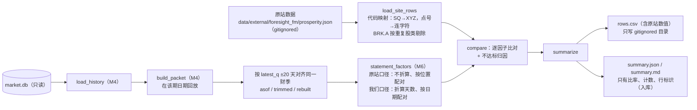
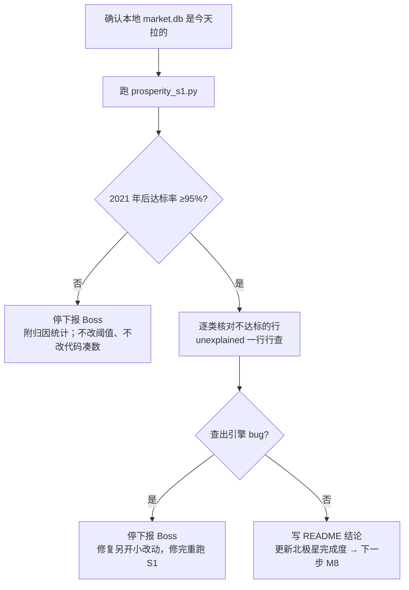

# 景气引擎 M7 S1 对拍工具 Implementation Plan

**Goal:** 用原站 47 期输出逐行核对我们的 6 个共有因子，给出 2021 年后 23 期的达标率（目标 95% 的行差 <0.5pp），把每条不达标的行归到一个原因类别。
**Architecture:** 纯比对模块 `backtest/research/prosperity_s1.py` 做四件事：读原站数据、在我们这边取同一财季、两种口径比对并归因、汇总。取数和算因子全部复用 M4 的 `load_history` / `build_packet` 和 M6 的 `statement_factors`，M7 不另写因子公式。只读 CLI `scripts/prosperity_s1.py` 负责串起来，并把输出分成两份：含原站数值的明细只写进 gitignored 目录；只含比率和计数的汇总入库。
**Tech Stack:** Python（本地 `.venv` 3.13，写法保持 3.10 兼容）、标准库 `csv` / `json` / `dataclasses`、pytest
**Spec:** `docs/design/prosperity-engine-north-star.md` 第二层"S1 对拍工具（R3）"；`docs/design/prosperity-engine-requirements.md` S1；原站口径 `docs/design/prosperity-engine-original-spec.md` §1–2；M6 留给 M7 的接口 `docs/plans/2026-09-29-prosperity-m5-m6-scheme-and-kernel.md`"与 M7 的接口"
**北极星对齐:** 第二层因子与打分内核（M7 S1 对拍，MVP 验收项）；需求 R3、S1
**依赖:** M4/M6 已在 main（`735cbd54`，`code_version` `ee4495acd0715621`）。M7 不改引擎代码，`code_version` 应保持不变

## Boss 决定

> Boss 2026-09-30 已同意：47 期全跑，只用 2021 年后 23 期算 95% 达标率；本地没数据的股票不算进分母，单独列出原因；SQ、BRK.B 先按别名对上再比。下面两项是写 plan 时才定下来的口径细节，Boss 2026-09-30 批注：D-1、D-2 都按推荐（A）。

### D-1 达标率怎么算

- **选项**：A 用原站口径那一版计分；分母 = 原站有值、且我们有这只股票的行；我们缺值算不达标（带上引擎给的缺失原因）；6 个因子合并算一个达标率，按因子、按期的达标率只展示，不另设门槛。B 同 A，但只统计双方都有值的行（我们缺值的行不进分母）。C 同 A，但 6 个因子各自都要 ≥95%
- **推荐**：**A**
- **理由**：北极星要求"另跑一版原站口径，把口径差异和数据差异分开"，所以数据核对只能用原站口径那一版计分。我们的口径（按天数折算、按日期配对）是有意改的，那版的差异属于口径差异。B 会把我们大面积缺值藏起来。需求原文是"约 95% 的行"，没有要求每个因子分别达标，C 属于加码；按因子的达标率照样展示，哪个因子明显偏低，README 里单独说明
- **Boss 批注**：同意 A（2026-09-30）

### D-2 比哪一季

- **选项**：A 比同一个财季：取我们与原站 `latest_q` 相差 ±20 天内的那一季。如果我们在该期日期已经有更新的一季，就截到那一季；如果我们在该期日期还没有那一季，就把回放日期推后最多 120 天重建（不越过 2026-09-28，免得切到严格点时模式），再截到那一季。"当前季是否一致"作为时点指标单独展示，不计入达标率。B 只比我们在该期日期的当前季，当前季不同的行直接算不达标
- **推荐**：**A**
- **理由**：S1 是数据核对，比的应该是同一季的数。当前季不一致反映的是发布日判定的差别，与数据对错无关；这部分单独统计，M9 做历史重建时会用到这个数
- **Boss 批注**：同意 A（2026-09-30）

### 顺带更正（不需要拍板）

上次说"剩下的都是 100 亿美元以下的小票"不准确。BRK.A 是伯克希尔 A 股，2021 年后出现的 13 期里每期都和 BRK.B 同时在榜。它和 BRK.B 是同一家公司、同一套财报，再比一遍等于重复计数，所以按"同一公司另一股类"剔除，单独列出。2021 年后剔除的行数：BRK.A 13 行 + 11 只小票 14 行 = 27 行（约 2.4%）。

## 架构图



## 业务流程图



## 替代方案

| 方案 | 优点 | 缺点 | 选择 |
|---|---|---|---|
| A. 复用 M4 取数 + M6 因子公式（带原站口径开关），M7 只做对齐、比对、归因（选定） | 核对的就是生产要用的那份代码；M6 已为此留好开关；新代码最少 | 如果原站口径那条路径本身写错，会误报不达标（不会误报达标） | ✓ |
| B. M7 从原始行另写一套因子公式 | 与引擎相互独立 | 两套公式并存，违背 M6 plan"同一份公式，不让 M7 另写一套"；独立性其实已经由原站数据提供 | |
| C. 只比每季的营收、毛利率等原始输入，不比因子 | 最简单，直接定位数据差异 | 验证不了我们的公式和配对，S1 要求比的是因子层 | |

A 同时用上了 C 的长处：原站每行带 8 季序列（营收、毛利率、FCF 率、净利率），只在归因时用，用来判断差异出在哪一季、哪个输入。

## 风险自证

- **最大风险：比对工具本身出错，给出错误的"达标"。** 应对：①归因只解释不达标的行，不影响是否达标；②原站修复字段不认识时，不拿它来解释差异，交给人工；③验收时抽 5 行，用只依赖 sqlite3 的脚本从原始报表独立复算，核对工具取季和计算的结果；④`aligned_by` 与时点一致率全部公开，如果不达标的行集中在截断或重建的行，就能看出来。
- **第二风险：原站数据外泄。** 应对：写明细前，CLI 到目标位置所在的 git 仓库里查 `rows.csv` 是否被忽略（`git check-ignore`）。只要目标在某个仓库里、又没被忽略，就退出码 4。从 worktree 运行、指向主仓库 `reports/` 的路径也会被拦下（v1 按 `PROJECT_ROOT` 判断会放行这种情况）。确认不了 git 状态时同样拒绝。入库的汇总有测试保证不含任何数值。
- **S1 覆盖不到的部分：** 我们口径（折算天数、按日期配对）的正确性，只在两种口径结果相同的行上得到验证。其余行靠 M6 的单测和 M6 验收时的独立复算。EPS、预期、PE 不在共有因子里，S1 不验证。所以 M4 遗留的 APH street EPS 短孤岛问题 S1 解决不了：APH 不在原站数据里，EPS 也不是共有因子。它仍然是已知限制，需要另外找一手来源核实。
- **为什么不更简单：** 只算达标率不归因，会剩下约 300 行（23 期 × 约 47 行 × 6 因子的 5%）需要人工一行行查。用原站自带的 8 季序列自动归类后，只有 `unexplained` 类需要人工看。

## 验收标准（Boss 不看代码也能判断）

1. `pytest tests/test_prosperity_s1.py` 全部通过；景气相关全量测试不回退
2. 真实数据跑完：47 期全部有结果，报错 0；每一期都满足"原站行数 = 已比对 + 剔除 + 报错"（汇总里 `reconciled` 为 true）
3. **门槛（D-1 A）**：2021 年后 23 期，原站口径合并达标率 ≥95%。不达标：停下来报 Boss，不改阈值
4. 每一条不达标的行都有类别：`ours_missing`（带引擎缺失原因）/ `site_repaired` / `quarter_sequence` / `input_diff`（带字段和季度）/ `unexplained`。`unexplained` 逐行人工查清并写进 README
5. 我们口径那一版的达标率与原站口径并列展示；只在我们口径下不达标的行，归为 `basis_only_day_adjust` 或 `basis_only_pairing`
6. 时点指标：2021 年后"我们在该期日期的当前季与原站相同"的比例，以及 asof / trimmed / rebuilt 各自的行数
7. 剔除清单逐行保留（期、原站代码、原因：`not_in_our_data` / `duplicate_share_class`），全期与 2021 年后分开计数；2021 年后应为 27 行（BRK.A 13 行 + 小票 14 行）
8. 独立抽检 5 行（3 行达标、2 行不达标）：sqlite3 复算结果与工具结果一致
9. `git status` 里没有任何含原站数值的文件；`code_version` 仍为 `ee4495acd0715621`

## Global Constraints

- S1 只做因子层比对，不复刻分数和评级（Boss 2026-09-26 确认）
- 共有因子：营收同比、营收加速、毛利率及其同比、FCF 率同比、净利率同比
- 目标：2021 年以后各期约 95% 的行差 <0.5pp；其余逐个说明原因（FMP 重述、原站修复、缺季等）
- 另跑一版原站口径（不折算天数、按位置配对），把口径差异和数据差异分开
- 同一份公式：用 M6 `statement_factors(quarters, day_adjust=False, pairing="position")`，不让 M7 另写一套
- 与原站 `latest_q` 按 ±20 天配对（`SAME_QUARTER_DAYS`）
- Boss 2026-09-30：47 期全跑，2021 年后 23 期算 95% 达标率；本地没数据的股票不进分母，单列原因；SQ、BRK.B 先别名映射
- S1 共有因子对拍准确率保持原定义，不能混同为本次的数据覆盖率门槛（2026-09-29 修订）
- 研究侧、只在本地跑；原站数据只放 gitignored 目录，不进 git、不外发
- `market.db` 只读；研究产物不写 `market.db`
- 查询前先确认本地 `market.db` 是最新拉取（真库在云端）
- 开发在 worktree；merge、push 每一步都停下来等 Boss 确认

## 比对与归因规则

**代码映射**：原站 `SQ` → `XYZ`（2025 年改代码）；其余点号改连字符（`BRK.B` → `BRK-B`）；`BRK.A` 标 `duplicate_share_class` 并剔除。映射后本地没有利润表的股票标 `not_in_our_data` 并剔除。`SQ→XYZ` 只在 M7 内部用；`config/symbol_aliases.json` 不动（它进 `code_version`，也管回放成员）。

**因子对照**（原站键 → 引擎键；比对单位都是 %/pp）：`revenue_yoy_pct`→`revenue_yoy`、`revenue_yoy_accel`→`revenue_accel`、`gm_pct`→`gm_level`、`gm_yoy_pp`→`gm_yoy`、`fcf_margin_yoy_pp`→`fcf_margin_yoy`、`net_margin_yoy_pp`→`net_margin_yoy`。

**达标**：`diff = 我们 − 原站`，`|diff| < 0.5` 为达标（0.5 本身不达标）。原站为空的行不计入分母（类别 `site_missing`，细分为 `ours_has_value` / `both_missing`）。

**归因**（只针对原站口径下不达标的行，按顺序取第一个命中的）：
1. `ours_missing`：我们这边为空，`detail` 为引擎给的缺失原因；取不到同一财季时为 `quarter_not_found`
2. `site_repaired`：原站 `dq.repairs` 修过这个因子用到的某一季、对应字段（`revenue`→营收、`gross_margin`→毛利率、`fcf_margin`→FCF 率、`net_margin`→净利率）；不认识的字段不解释
3. `quarter_sequence`：这个因子用到的某个位置（见下表），双方的财季日期相差超过 20 天，或者有一方缺这一季
4. `input_diff`：用到的某一季，输入值不一致。营收（百万）差 > max(0.1%, 0.06)，或者比率差 > 0.1pp。`detail` 写 `字段@季度`，例如 `rev@2025-03-31`；不是当季的差异多半是 FMP 重述
5. `unexplained`：输入都一致，因子却不一致，说明公式不同，必须人工查

| 因子 | 用到的输入 | 位置（相对当季，按位置） |
|---|---|---|
| 营收同比 | 营收 | 0, −4 |
| 营收加速 | 营收 | 0, −1, −4, −5 |
| 毛利率 | 毛利率 | 0 |
| 毛利率同比 | 毛利率 | 0, −4 |
| FCF 率同比 | FCF 率 | 0, −4 |
| 净利率同比 | 净利率 | 0, −4 |

**我们口径的归因**：原站口径达标、我们口径不达标时，只看这个因子自己用到的季度：按日期配对和按位置配对选中的季不同 → `basis_only_pairing`；相同 → `basis_only_day_adjust`（差异来自天数折算）。逐因子判断，不按整行。v1.1 修正：整行共用一个标记时，如果只有上季缺基期、当季又是 98 天，营收同比的折算差异会被误标成配对差异。各因子比较哪些配对：营收同比、毛利率同比、FCF 率同比、净利率同比只看当季基期（日期配对 vs 位置 −4）；营收加速另外还看上一季（日期 vs −1）和上一季的基期（日期 vs −5）；毛利率不涉及配对。原站口径也不达标 → 用上面同一套归因。

**时点**：在该期日期回放时我们的当前季与 `latest_q` 比，相差 ≤20 天为 `match`，否则 `ours_ahead` / `ours_behind`；取不到当前季为 `ours_none`。

## 文件结构

| 文件 | 动作 | 职责 |
|---|---|---|
| `backtest/research/prosperity_s1.py` | 新建 | 纯函数：读原站行、对齐同一季、两口径比对与归因、汇总与 markdown；不读库、不写文件 |
| `scripts/prosperity_s1.py` | 新建 | 只读 CLI：打开 `market.db`、逐期逐行回放、调用上面的纯函数、分开写明细与汇总 |
| `tests/test_prosperity_s1.py` | 新建 | 合成数据测试，不依赖原站数据文件 |
| `reports/prosperity/m7-s1-20260930/` | 新建（Task 6） | `summary.json` / `summary.md`（CLI 生成）、`README.md`（人工结论）、`spot_check.py` + `spot_check.json` |
| `docs/design/prosperity-engine-north-star.md` | 修改（Task 6） | 模块表 M7 行与"各层完成度"写入 S1 结果 |
| `docs/CHANGELOG.md` | 修改（Task 6） | M7 里程碑一行 |

引擎包 `terminal/prosperity/` 与 `CODE_VERSION_SOURCES` 里的任何文件都不改。

## 执行顺序

先建 worktree：`git worktree add .worktrees/prosperity-m7 -b prosperity-m7 main`。测试用主仓库 `.venv`（`/Users/owen/CC workspace/Finance/.venv/bin/python -m pytest …`）；合成测试不需要真实数据。Task 1 → 5 依次做，每个任务一个 checkpoint；Task 6 用真实数据验收。全程 inline，不开 subagent。

### Task 1: 读原站数据与代码映射

**Files:**
- Create: `backtest/research/prosperity_s1.py`
- Test: `tests/test_prosperity_s1.py`

**Interfaces:**
- Produces:
  - `FACTORS: Tuple[Tuple[str, str], ...]`：(原站键, 引擎键) 6 对，顺序同上表
  - `SeriesQuarter(fiscal_date: str, rev: Optional[float], gm: Optional[float], fcfm: Optional[float], nim: Optional[float])`：冻结 dataclass；`rev` 以百万为单位，其余为 %
  - `SiteRow(board: str, site_symbol: str, symbol: str, latest_q: str, filed: Optional[str], values: Mapping[str, Optional[float]], quarters: Tuple[SeriesQuarter, ...], repairs: Tuple[Tuple[str, str], ...], skip_reason: Optional[str])`：冻结 dataclass；`values` 以引擎键为键；`repairs` 为 (季度, 映射后的字段)
  - `our_symbol(site_symbol: str) -> str`
  - `load_site_rows(data: Mapping) -> List[SiteRow]`：按原站文件顺序展开每期每行

- [ ] Step 1: 写失败测试

```python
import csv
import json
from datetime import date, timedelta

import pytest

from backtest.research import prosperity_s1 as s1
from tests.prosperity_fixtures import qends, qin

Q8 = qends(8)                      # 2024-09-30 … 2026-06-30
FLAT = {"revenue_yoy_pct": 0.0, "revenue_yoy_accel": 0.0, "gm_pct": 50.0, "gm_yoy_pp": 0.0,
        "fcf_margin_yoy_pp": 0.0, "net_margin_yoy_pp": 0.0}


def site_row(symbol="AAA", values=None, series=None, repairs=()):
    """One row in the original site's JSON shape; series default to a flat business (revenue 100M)."""
    s = dict(series or {})
    q = s.get("q", Q8)
    n = len(q)
    return {"symbol": symbol, "latest_q": q[-1], "filed": "2026-08-01", "q_series": list(q),
            "rev_abs_series": s.get("rev", [100.0] * n), "gm_series": s.get("gm", [50.0] * n),
            "fcfm_series": s.get("fcfm", [20.0] * n), "nim_series": s.get("nim", [10.0] * n),
            "dq": {"repairs": [{"quarter": d, "field": f} for d, f in repairs]},
            **FLAT, **(values or {})}


def fixture(*boards):
    return {"asof": "2026-09-02", "boards": [{"asof": a, "rows": rows} for a, rows in boards]}


def flat_quarters(n=8):
    return [qin(f, rev=100e6) for f in qends(n)]     # gross 50%, net 10%, FCF 20% of revenue


def test_load_site_rows_maps_symbols_and_factor_keys():
    data = fixture(("2026-06-30", [site_row("SQ"), site_row("BRK.B"), site_row("BRK.A"), site_row("MSFT")]))
    rows = s1.load_site_rows(data)
    assert [(r.site_symbol, r.symbol, r.skip_reason) for r in rows] == [
        ("SQ", "XYZ", None), ("BRK.B", "BRK-B", None), ("BRK.A", "BRK-A", "duplicate_share_class"),
        ("MSFT", "MSFT", None)]
    r = rows[-1]
    assert (r.board, r.latest_q) == ("2026-06-30", Q8[-1])
    assert r.values == {"revenue_yoy": 0.0, "revenue_accel": 0.0, "gm_level": 50.0, "gm_yoy": 0.0,
                        "fcf_margin_yoy": 0.0, "net_margin_yoy": 0.0}
    assert [q.fiscal_date for q in r.quarters] == Q8
    last = r.quarters[-1]
    assert (last.rev, last.gm, last.fcfm, last.nim) == (100.0, 50.0, 20.0, 10.0)


def test_load_site_rows_keeps_nulls_and_maps_repair_fields():
    row = site_row(values={"fcf_margin_yoy_pp": None}, repairs=[(Q8[-1], "gross_margin"), (Q8[-2], "mystery")])
    r = s1.load_site_rows(fixture(("2026-06-30", [row])))[0]
    assert r.values["fcf_margin_yoy"] is None
    assert r.repairs == ((Q8[-1], "gm"), (Q8[-2], "mystery"))
```

- [ ] Step 2: 跑 `pytest tests/test_prosperity_s1.py -v` → 预期 FAIL（`ModuleNotFoundError: backtest.research.prosperity_s1`）
- [ ] Step 3: 最小实现。模块 docstring 写明用途、原站数据私有、只读纯函数。常量：`FACTORS`；`SYMBOL_MAP = {"SQ": "XYZ"}`（注释：2025 年改代码）；`SKIP = {"BRK.A": "duplicate_share_class"}`（注释：与 BRK.B 同一发行人、同一套报表，2021 年后每次都同榜）；`REPAIR_FIELDS = {"revenue": "rev", "gross_margin": "gm", "fcf_margin": "fcfm", "net_margin": "nim"}`，不认识的字段原样保留。`our_symbol`：先查 `SYMBOL_MAP`，再把 `.` 换成 `-`。`load_site_rows`：遍历 `data["boards"]` 与每期 `rows`；`quarters` 由 `q_series` 与四个 `*_series` 按下标 zip（某条序列缺失或比季度短时，对应值记 None）；`repairs` 取 `(row.get("dq") or {}).get("repairs") or []` 的 `quarter[:10]` 与映射后字段
- [ ] Step 4: 跑 → 预期 2 passed
- [ ] Step 5: commit `git add backtest/research/prosperity_s1.py tests/test_prosperity_s1.py && git commit -m "feat(prosperity-m7): read the original site's rows with symbol mapping"`

### Task 2: 我们这边取同一财季，两种口径算因子

**Files:**
- Modify: `backtest/research/prosperity_s1.py`
- Test: `tests/test_prosperity_s1.py`

**Interfaces:**
- Consumes: `terminal.prosperity.factors.statement_factors(quarters, *, day_adjust, pairing) -> FactorOut`、`year_base(fiscals, i)`、`prior_quarter(fiscals, i)`；`terminal.prosperity.types.QuarterInputs`；`src.data.prosperity_history.SAME_QUARTER_DAYS`（20）
- Produces:
  - `BASES = {"site": {"day_adjust": False, "pairing": "position"}, "ours": {"day_adjust": True, "pairing": "date"}}`
  - `match_index(quarters: Sequence[QuarterInputs], latest_q: str) -> Optional[int]`：与 `latest_q` 相差 ≤20 天的最近一季下标
  - `timing_status(current_fiscal: Optional[str], latest_q: str) -> str`：`match` / `ours_ahead` / `ours_behind` / `ours_none`
  - `OurSide(fiscal_date: str, aligned_by: str, values: Mapping[str, Mapping[str, Optional[float]]], missing: Mapping[str, Mapping[str, str]], quarters: Tuple[SeriesQuarter, ...], pairing_differs: Mapping[str, bool])`：冻结 dataclass；`values` / `missing` 第一层键为口径 `site` / `ours`，第二层为引擎键；`pairing_differs` 以引擎键为键，逐因子标出按日期配对与按位置配对是否选中了不同的季
  - `our_side(quarters: Sequence[QuarterInputs], aligned_by: str) -> OurSide`：`quarters[-1]` 就是要比的那一季（调用方已截断）

- [ ] Step 1: 写失败测试

```python
def test_match_index_pairs_the_same_fiscal_quarter_within_20_days():
    qs = flat_quarters()
    assert s1.match_index(qs, Q8[-1]) == 7
    assert s1.match_index(qs, "2026-06-12") == 7          # 18 days apart still pairs
    assert s1.match_index(qs, Q8[-2]) == 6                # ours is a quarter ahead: trim to index 6
    assert s1.match_index(qs, "2026-09-30") is None       # ours is behind


def test_timing_status():
    assert s1.timing_status("2026-06-30", "2026-06-25") == "match"
    assert s1.timing_status("2026-06-30", "2026-03-31") == "ours_ahead"
    assert s1.timing_status("2026-03-31", "2026-06-30") == "ours_behind"
    assert s1.timing_status(None, "2026-06-30") == "ours_none"


def test_our_side_computes_both_bases_and_input_series():
    qs = [qin(f, rev=r * 1e6) for f, r in zip(Q8, [100, 100, 100, 100, 100, 110, 130, 140])]
    qs[-1] = qin(Q8[-1], rev=140e6, gm=0.6, nm=0.08, fcfm=0.25, days=98)
    ours = s1.our_side(qs, aligned_by="asof")
    assert (ours.fiscal_date, ours.aligned_by) == (Q8[-1], "asof")
    assert len(ours.pairing_differs) == 6 and not any(ours.pairing_differs.values())
    assert ours.values["site"]["revenue_yoy"] == pytest.approx(40.0)          # unadjusted 140 vs 100
    assert ours.values["ours"]["revenue_yoy"] == pytest.approx(30.0)          # 140 × 91/98 = 130 vs 100
    assert ours.values["site"]["gm_yoy"] == pytest.approx(10.0)
    assert len(ours.quarters) == 8
    q = ours.quarters[-1]
    assert (q.fiscal_date, q.rev) == (Q8[-1], pytest.approx(140.0))            # millions
    assert (q.gm, q.fcfm, q.nim) == (pytest.approx(60.0), pytest.approx(25.0), pytest.approx(8.0))


def test_pairing_differs_when_the_year_ago_quarter_is_missing():
    qs = [q for i, q in enumerate(flat_quarters()) if i != 3]
    ours = s1.our_side(qs, aligned_by="asof")
    assert ours.pairing_differs["revenue_yoy"] is True and ours.pairing_differs["revenue_accel"] is True
    assert ours.pairing_differs["gm_level"] is False
    assert ours.values["ours"]["revenue_yoy"] is None and ours.missing["ours"]["revenue_yoy"] == "no_yoy_base"
    assert ours.values["site"]["revenue_yoy"] == pytest.approx(0.0)           # position takes quarters[-5]
```

- [ ] Step 2: 跑 → 预期 FAIL（`AttributeError: module ... has no attribute 'match_index'`）
- [ ] Step 3: 最小实现。`match_index`：在 `abs(日期差) ≤ SAME_QUARTER_DAYS` 的季里取差最小的下标。`timing_status`：None → `ours_none`；差 ≤20 天 → `match`；否则按先后分 ahead / behind。`our_side`：对 `BASES` 两种口径各调用一次 `statement_factors`，`values` 取 `FACTORS` 的 6 个引擎键，`missing` 取其中为空的键及原因；`quarters` 取最后 8 季，算出 `rev = revenue / 1e6`、`gm/fcfm/nim = gross_profit / free_cash_flow / net_income ÷ revenue × 100`（营收缺失或 ≤0 时比率为 None）；`pairing_differs` 逐因子算：设当季下标 c，按位置的下标 <0 时视为 None；`cur = year_base(fiscals, c) != c − 4`；`p = prior_quarter(fiscals, c)`，`prior = p != c − 1 or (p is not None and year_base(fiscals, p) != c − 5)`。营收同比、毛利率同比、FCF 率同比、净利率同比取 `cur`；营收加速取 `cur or prior`；毛利率为 False
- [ ] Step 4: 跑 → 预期 6 passed
- [ ] Step 5: commit `git commit -am "feat(prosperity-m7): same-quarter alignment and both-basis factors on our side"`

### Task 3: 逐因子比对与归因

**Files:**
- Modify: `backtest/research/prosperity_s1.py`
- Test: `tests/test_prosperity_s1.py`

**Interfaces:**
- Consumes: `SiteRow`、`OurSide`、`FACTORS`、`BASES`
- Produces:
  - `TOLERANCE_PP = 0.5`、`REV_REL_TOL = 0.001`、`REV_ABS_TOL_M = 0.06`、`MARGIN_TOL_PP = 0.1`
  - `DEPENDS: Mapping[str, Tuple[str, Tuple[int, ...]]]`：引擎键 → (输入字段, 位置)，取值同"比对与归因规则"表
  - `Comparison(board, symbol, site_symbol, fiscal_date, factor, basis, site_value, our_value, diff, counted, passed, category, detail, aligned_by)`：冻结 dataclass；`fiscal_date` 为我们对齐到的那一季（取不到时为原站 `latest_q`）
  - `compare(site: SiteRow, ours: Optional[OurSide], missing_reason: str = "") -> List[Comparison]`：固定返回 12 条（6 因子 × 2 口径）；`ours` 为 None 时用 `missing_reason`

- [ ] Step 1: 写失败测试

```python
def compare_one(values=None, series=None, repairs=(), quarters=None, ours_missing=""):
    site = s1.load_site_rows(fixture(("2026-06-30", [site_row(values=values, series=series, repairs=repairs)])))[0]
    ours = None if ours_missing else s1.our_side(quarters or flat_quarters(), aligned_by="asof")
    return {(c.factor, c.basis): c for c in s1.compare(site, ours, missing_reason=ours_missing)}


def test_matching_row_passes_every_factor_on_both_bases():
    out = compare_one()
    assert len(out) == 12
    assert all(c.counted and c.passed and c.category == "match" for c in out.values())
    assert {c.fiscal_date for c in out.values()} == {Q8[-1]}


def test_diff_is_ours_minus_site_and_the_bound_is_strict():
    out = compare_one(values={"gm_pct": 50.4, "gm_yoy_pp": 0.5})
    assert out[("gm_level", "site")].passed and out[("gm_level", "site")].diff == pytest.approx(-0.4)
    assert not out[("gm_yoy", "site")].passed                     # |diff| = 0.5 is not < 0.5


def test_inputs_agree_but_factor_differs_is_unexplained():
    assert compare_one(values={"revenue_yoy_pct": 3.0})[("revenue_yoy", "site")].category == "unexplained"


def test_input_difference_names_field_and_quarter():
    rev = [100.0] * 8
    rev[3] = 97.0                                                  # their year-ago revenue differs
    c = compare_one(values={"revenue_yoy_pct": 3.1}, series={"rev": rev})[("revenue_yoy", "site")]
    assert (c.category, c.detail) == ("input_diff", f"rev@{Q8[3]}")


def test_input_tolerance_absorbs_rounding():
    rev = [100.0] * 8
    rev[3] = 100.05                                                # one-decimal rounding on their side
    c = compare_one(values={"revenue_yoy_pct": 3.0}, series={"rev": rev})[("revenue_yoy", "site")]
    assert c.category == "unexplained"


def test_site_repair_explains_only_known_fields():
    known = compare_one(values={"gm_pct": 55.0}, repairs=[(Q8[-1], "gross_margin")])
    unknown = compare_one(values={"gm_pct": 55.0}, repairs=[(Q8[-1], "mystery")])
    assert known[("gm_level", "site")].category == "site_repaired"
    assert unknown[("gm_level", "site")].category == "unexplained"


def test_quarter_sequence_mismatch():
    qs = [q for i, q in enumerate(flat_quarters(9)) if i != 4]     # ours lacks 2025-06-30
    c = compare_one(values={"revenue_yoy_pct": 5.0}, quarters=qs)[("revenue_yoy", "site")]
    assert c.category == "quarter_sequence"


def test_our_missing_value_carries_the_engine_reason():
    qs = flat_quarters()
    qs[-1] = qin(Q8[-1], rev=100e6, fcfm=0.0)                        # FCF exactly 0: placeholder
    c = compare_one(quarters=qs)[("fcf_margin_yoy", "site")]
    assert (c.counted, c.passed, c.category, c.detail) == (True, False, "ours_missing", "fcf_zero_placeholder")


def test_quarter_not_found_fails_every_counted_factor():
    out = compare_one(ours_missing="quarter_not_found")
    assert len(out) == 12
    assert all(c.counted and not c.passed and (c.category, c.detail) == ("ours_missing", "quarter_not_found")
               for c in out.values())


def test_site_null_is_not_counted():
    c = compare_one(values={"fcf_margin_yoy_pp": None})[("fcf_margin_yoy", "site")]
    assert (c.counted, c.category, c.detail) == (False, "site_missing", "ours_has_value")


def test_basis_only_day_adjust():
    qs = flat_quarters()
    qs[-1] = qin(Q8[-1], rev=100e6, days=98)                         # 14-week quarter
    out = compare_one(quarters=qs)
    assert out[("revenue_yoy", "site")].passed
    assert out[("revenue_yoy", "ours")].category == "basis_only_day_adjust"


def test_basis_only_pairing():
    qs = [q for i, q in enumerate(flat_quarters()) if i != 3]
    out = compare_one(quarters=qs, series={"q": [q.fiscal_date for q in qs]})
    assert out[("revenue_yoy", "site")].passed
    c = out[("revenue_yoy", "ours")]
    assert (c.category, c.our_value) == ("basis_only_pairing", None)


def test_basis_split_is_judged_per_factor():
    # drop 2025-03-31: the current quarter keeps its year-ago base, only the prior quarter loses one
    qs = [q for i, q in enumerate(flat_quarters(9)) if i != 3]
    qs[-1] = qin(qs[-1].fiscal_date, rev=100e6, days=98)
    out = compare_one(quarters=qs, series={"q": [q.fiscal_date for q in qs]})
    assert out[("revenue_yoy", "site")].passed and out[("revenue_accel", "site")].passed
    assert out[("revenue_yoy", "ours")].category == "basis_only_day_adjust"
    assert out[("revenue_accel", "ours")].category == "basis_only_pairing"
```

- [ ] Step 2: 跑 → 预期 FAIL（`AttributeError: ... 'compare'`）
- [ ] Step 3: 最小实现。`compare` 对每个 (原站键, 引擎键) 与口径 `site`、`ours` 依次处理：原站值为 None → `counted=False`、`site_missing`（`detail` 看我们这一口径的值有没有：`ours_has_value` / `both_missing`）；否则 `counted=True`，`diff = ours − site`（任一侧 None 时 diff 为 None），`passed = diff is not None and abs(diff) < TOLERANCE_PP`，达标类别为 `match`。不达标时：`ours` 口径若同因子 `site` 口径达标 → `basis_only_pairing`（`ours.pairing_differs[因子]` 为 True）或 `basis_only_day_adjust`；否则调用私有 `_classify(site, ours, factor, basis)`，按"比对与归因规则"第 1–5 条的顺序归类。位置对齐：双方各自以最后一季为 0，第 k 位是各自序列的 `len − 1 + k`；日期相差 >20 天或任一方越界 → `quarter_sequence`，`detail` 写 `offset k`。输入比较：营收用 `abs(差) > max(REV_REL_TOL × abs(原站值), REV_ABS_TOL_M)`，比率用 `abs(差) > MARGIN_TOL_PP`；一侧为 None 另一侧有值也算不一致。修复匹配：修复季度与所用位置的原站季度日期 ±20 天内，且字段等于该因子的输入字段。`aligned_by` 取 `ours.aligned_by`，`ours` 为 None 时为 `none`
- [ ] Step 4: 跑 → 预期 19 passed
- [ ] Step 5: commit `git commit -am "feat(prosperity-m7): per-factor comparison with cause classification"`

### Task 4: 汇总与 markdown

**Files:**
- Modify: `backtest/research/prosperity_s1.py`
- Test: `tests/test_prosperity_s1.py`

**Interfaces:**
- Consumes: `Comparison`
- Produces:
  - `GATE_SINCE = "2021-01-01"`、`GATE_PCT = 95`
  - `summarize(comparisons: Sequence[Comparison], *, site_rows: Mapping[str, int], excluded: Sequence[Tuple[str, str, str]], errors: Sequence[Tuple[str, str, str]], timing: Sequence[Tuple[str, str, str, str]], since: str = GATE_SINCE) -> Dict[str, Any]`：`site_rows` 为每期原站行数；`excluded` 每项为 (期, 原站代码, 原因)；`errors` 每项为 (期, 原站代码, 报错信息)；`timing` 每项为 (期, 股票, 时点状态, 对齐方式)。返回键：
    - `gate`：`since`、`boards`（`site_rows` 里 `since` 起的期数）、`counted`、`passed`、`rate`、`threshold_pct`、`pass`
    - `by_factor`
    - `by_board`：覆盖全部期。字段有 `site_rows`、`compared`（该期比对里出现的不同原站代码数）、`excluded`、`errors`、`reconciled`（前三项之和等于 `site_rows`）、原站口径的 `counted` / `passed` / `rate`
    - `reconciled`：所有期都对上
    - `categories`：`site` / `ours` 各一张计数表，只算 `since` 起
    - `ours_basis`、`timing`、`aligned_by`
    - `pre_since`：`since` 之前各期原站口径的 counted / passed / rate / categories
    - `excluded`：`symbols`（原站代码 → 原因）、`rows_all`、`rows_since`、`list`（逐行 {board, site_symbol, reason}）
    - `errors`：逐行 {board, site_symbol, message}
    - `failures`：`since` 起原站口径不达标的行，字段为 board、symbol、site_symbol、factor、category、detail

    汇总里不含任何原站值或我们的值
  - `summary_markdown(summary: Mapping[str, Any]) -> str`

- [ ] Step 1: 写失败测试

```python
def comp(board, factor="revenue_yoy", basis="site", passed=True, counted=True, category="match"):
    return s1.Comparison(board=board, symbol="AAA", site_symbol="AAA", fiscal_date="2026-06-30", factor=factor,
                         basis=basis, site_value=1.0 if counted else None, our_value=1.0,
                         diff=0.0 if passed else 1.0, counted=counted, passed=passed,
                         category=category, detail="", aligned_by="asof")


def test_summarize_gates_on_the_site_basis_since_2021():
    comps = ([comp("2021-03-31")] * 19 + [comp("2021-03-31", passed=False, category="input_diff")]
             + [comp("2020-12-31", passed=False, category="unexplained")] * 5
             + [comp("2021-03-31", basis="ours", passed=False, category="basis_only_day_adjust")] * 10
             + [comp("2021-03-31", counted=False, passed=False, category="site_missing")] * 3)
    timing = [("2021-03-31", "AAA", "match", "asof"), ("2021-03-31", "BBB", "ours_ahead", "trimmed"),
              ("2020-12-31", "AAA", "match", "asof")]
    excluded = [("2021-03-31", "MARA", "not_in_our_data"), ("2020-12-31", "MARA", "not_in_our_data")]
    s = s1.summarize(comps, site_rows={"2020-12-31": 2, "2021-03-31": 3}, excluded=excluded,
                     errors=[("2021-03-31", "CCC", "ValueError: bad row")], timing=timing, since="2021-01-01")
    g = s["gate"]
    assert (g["boards"], g["counted"], g["passed"], g["pass"]) == (1, 20, 19, True)
    assert g["rate"] == pytest.approx(0.95)
    assert s["by_factor"]["revenue_yoy"] == {"counted": 20, "passed": 19, "rate": pytest.approx(0.95)}
    assert s["by_board"]["2021-03-31"] == {"site_rows": 3, "compared": 1, "excluded": 1, "errors": 1,
                                           "reconciled": True, "counted": 20, "passed": 19,
                                           "rate": pytest.approx(0.95)}
    assert s["by_board"]["2020-12-31"]["reconciled"] is True and s["reconciled"] is True
    assert s["categories"]["site"] == {"match": 19, "input_diff": 1, "site_missing": 3}
    assert s["categories"]["ours"] == {"basis_only_day_adjust": 10}
    assert s["timing"] == {"match": 1, "ours_ahead": 1} and s["aligned_by"] == {"asof": 1, "trimmed": 1}
    assert (s["pre_since"]["counted"], s["pre_since"]["passed"]) == (5, 0)
    assert s["excluded"] == {"symbols": {"MARA": "not_in_our_data"}, "rows_all": 2, "rows_since": 1,
                             "list": [{"board": "2021-03-31", "site_symbol": "MARA", "reason": "not_in_our_data"},
                                      {"board": "2020-12-31", "site_symbol": "MARA", "reason": "not_in_our_data"}]}
    assert s["errors"] == [{"board": "2021-03-31", "site_symbol": "CCC", "message": "ValueError: bad row"}]


def test_gate_fails_below_95_percent():
    comps = [comp("2022-06-30")] * 18 + [comp("2022-06-30", passed=False, category="unexplained")] * 2
    s = s1.summarize(comps, site_rows={"2022-06-30": 1}, excluded=[], errors=[], timing=[], since="2021-01-01")
    assert s["gate"]["pass"] is False and s["gate"]["rate"] == pytest.approx(0.9)


def test_failure_list_names_rows_without_values():
    s = s1.summarize([comp("2022-06-30", passed=False, category="input_diff")], site_rows={"2022-06-30": 1},
                     excluded=[], errors=[], timing=[], since="2021-01-01")
    assert s["failures"] == [{"board": "2022-06-30", "symbol": "AAA", "site_symbol": "AAA",
                              "factor": "revenue_yoy", "category": "input_diff", "detail": ""}]
    assert "site_value" not in json.dumps(s) and "our_value" not in json.dumps(s)


def test_summary_markdown_lists_gate_and_failures():
    s = s1.summarize([comp("2022-06-30", passed=False, category="input_diff")], site_rows={"2022-06-30": 1},
                     excluded=[], errors=[], timing=[], since="2021-01-01")
    md = s1.summary_markdown(s)
    assert "未达标" in md and "| 2022-06-30 | AAA | revenue_yoy | input_diff |" in md


def test_a_board_whose_rows_do_not_add_up_is_not_reconciled():
    s = s1.summarize([comp("2022-06-30")], site_rows={"2022-06-30": 2}, excluded=[], errors=[], timing=[],
                     since="2021-01-01")
    assert s["by_board"]["2022-06-30"]["reconciled"] is False and s["reconciled"] is False
```

- [ ] Step 2: 跑 → 预期 FAIL（`AttributeError: ... 'summarize'`）
- [ ] Step 3: 最小实现。按期分成 `since` 起与 `since` 前两组；门槛用整数比较 `passed * 100 >= counted * GATE_PCT`（counted 为 0 时不达标），避免浮点边界；`rate = passed / counted`（counted 为 0 时为 None）。`timing` / `aligned_by` 只统计 `since` 起的项。`by_board` 以 `site_rows` 里的期为准，逐期对账；`excluded.rows_since` 与 `categories` 一样按 `since` 切分。`summary_markdown` 依次输出：结论（"达标" / "未达标" + 达标率 + 门槛）、按因子表、按期表（含原站行数、已比对、剔除、报错、是否对上）、两口径归因计数表、时点与对齐方式、剔除清单、2021 年前参考、不达标清单（表头 `| 期 | 股票 | 因子 | 类别 | 说明 |`；股票列在 `symbol != site_symbol` 时写 `XYZ/SQ`）。比率格式为 `95.0%`
- [ ] Step 4: 跑 → 预期 24 passed
- [ ] Step 5: commit `git commit -am "feat(prosperity-m7): gate summary and markdown without site values"`

### Task 5: 只读 CLI

**Files:**
- Create: `scripts/prosperity_s1.py`
- Test: `tests/test_prosperity_s1.py`

**Interfaces:**
- Consumes: `MarketStore(db_path, read_only=True)`；`terminal.prosperity.loader.load_history(store, symbol, *, with_vintage)`；`terminal.prosperity.packet.build_packet(history, as_of, *, mode, membership_basis, benchmark_closes, with_beta)`；`terminal.prosperity.config.STRICT_STATEMENTS_FROM`；Task 1–4 的全部函数
- Produces: `main(argv: Optional[List[str]] = None) -> int`；`private_dir_problem(path: Path) -> Optional[str]`（明细目录不安全时返回原因，安全时返回 None）；`REBUILD_DAYS = 120`。参数：`--fixture`（默认 `data/external/foresight_fm/prosperity.json`）、`--db`（默认 `data/market.db`）、`--private-dir`（必填）、`--report-dir`（必填）、`--since`（默认 `GATE_SINCE`）。退出码：0 达标、无报错且逐期对上；3 有逐行报错或某期行数对不上（优先于 5）；4 参数无效（明细目录会被 git 跟踪、原站文件不存在、日期格式不是 YYYY-MM-DD）；5 未达标

- [ ] Step 1: 写失败测试

```python
import subprocess                                  # 与其他 import 一起放到文件顶部

import scripts.prosperity_s1 as cli
from tests.prosperity_fixtures import bs, cf, inc, seed_db
from terminal.prosperity.types import SymbolHistory

Q12 = qends(12)


def _history(symbol):
    rows = []
    if symbol == "AAA":
        for f in Q12:
            accepted = (date.fromisoformat(f) + timedelta(days=30)).isoformat() + " 16:00:00"
            rows.append((f, f[:4], f"Q{(int(f[5:7]) - 1) // 3 + 1}", accepted))
    return SymbolHistory(symbol=symbol, income=[inc(*r, rev=100e6) for r in rows],
                         balance=[bs(*r) for r in rows], cashflow=[cf(*r) for r in rows], vintage={},
                         earnings=[], estimates=[], splits=[], closes=[], market_caps=[], profile=None,
                         is_adr=False)


def _cli_fixture(tmp_path):
    series = {"q": Q12[-8:], "gm": [60.0] * 8, "fcfm": [1.5e-5] * 8}   # inc(): gross 60%; cf(): FCF fixed at 15
    behind = [site_row("AAA", values={"gm_pct": 61.0}, series=series)]
    live = [site_row("AAA", values={"gm_pct": 60.0}, series=series), site_row("ZZZ")]
    path = tmp_path / "fixture.json"
    path.write_text(json.dumps(fixture(("2026-07-15", behind), ("2026-09-02", live))))
    return path


def test_cli_end_to_end_read_only(tmp_path, monkeypatch):
    db = seed_db(tmp_path / "m.db")
    seen, real = {}, cli.MarketStore

    def spy(db_path=None, read_only=False):
        seen["read_only"] = read_only
        return real(db_path=db_path, read_only=read_only)

    monkeypatch.setattr(cli, "MarketStore", spy)
    monkeypatch.setattr(cli, "load_history", lambda store, sym, with_vintage: _history(sym))
    private, report = tmp_path / "private", tmp_path / "report"
    code = cli.main(["--fixture", str(_cli_fixture(tmp_path)), "--db", str(db), "--private-dir", str(private),
                     "--report-dir", str(report)])
    assert code == 5 and seen["read_only"] is True                  # 11 / 12 = 91.7% < 95%
    s = json.loads((report / "summary.json").read_text())
    assert (s["gate"]["counted"], s["gate"]["passed"]) == (12, 11)
    assert s["timing"] == {"ours_behind": 1, "match": 1}             # 2026-06-30 files on 07-30
    assert s["aligned_by"] == {"rebuilt": 1, "asof": 1}
    assert s["excluded"] == {"symbols": {"ZZZ": "not_in_our_data"}, "rows_all": 1, "rows_since": 1,
                             "list": [{"board": "2026-09-02", "site_symbol": "ZZZ", "reason": "not_in_our_data"}]}
    assert s["reconciled"] is True and s["by_board"]["2026-09-02"]["site_rows"] == 2
    assert s["failures"] == [{"board": "2026-07-15", "symbol": "AAA", "site_symbol": "AAA", "factor": "gm_level",
                              "category": "unexplained", "detail": ""}]
    assert "61.0" not in (report / "summary.json").read_text() + (report / "summary.md").read_text()
    rows = list(csv.DictReader((private / "rows.csv").open()))
    assert len(rows) == 24 and any(r["site_value"] == "61.0" for r in rows)


def _git_repo(tmp_path):
    """A throwaway repository ignoring only /ignored/ (stands in for the main checkout seen from a worktree)."""
    repo = tmp_path / "repo"
    subprocess.run(["git", "init", "-q", str(repo)], check=True)
    (repo / ".gitignore").write_text("/ignored/\n")
    return repo


def test_private_dir_check_follows_the_owning_repository(tmp_path):
    repo = _git_repo(tmp_path)
    assert cli.private_dir_problem(repo / "reports" / "s1-private") is not None     # tracked location
    assert cli.private_dir_problem(repo / "ignored" / "s1") is None                   # ignored by that repo
    assert cli.private_dir_problem(tmp_path / "outside") is None                      # not in any repository


def test_cli_refuses_a_private_dir_git_would_track(tmp_path):
    target = _git_repo(tmp_path) / "reports" / "s1-private"
    code = cli.main(["--fixture", str(tmp_path / "f.json"), "--db", str(tmp_path / "m.db"),
                     "--private-dir", str(target), "--report-dir", str(tmp_path / "report")])
    assert code == 4 and not target.exists()
```

- [ ] Step 2: 跑 → 预期 FAIL（`ModuleNotFoundError: scripts.prosperity_s1`）
- [ ] Step 3: 最小实现，结构照 `scripts/prosperity_score.py`（`PROJECT_ROOT` 进 `sys.path`、`parse_args`、`main`）。顺序：①校验参数：`private_dir_problem(--private-dir)` 非 None → 打印原因、返回 4，且不创建任何目录。`private_dir_problem` 的规则：取 `<目录>/rows.csv` 的绝对路径（`resolve()`），找到最近一个已存在的上级目录，跑 `git -C <该目录> rev-parse --is-inside-work-tree`。退出码非 0 且 stderr 含 `not a git repository` → 不在任何仓库里，返回 None。在仓库里 → 跑 `git -C <该目录> check-ignore -q <rows.csv 绝对路径>`：退出码 0 → None；1 → 返回"会被 git 跟踪"。找不到 git 或出现其他失败 → 返回"无法确认 git 忽略状态"（fail-closed）。原站文件不存在或 `--since` 不是 YYYY-MM-DD → 4。②读原站文件 → `load_site_rows`。③`store = MarketStore(db_path=…, read_only=True)`。④按 `symbol` 缓存 `load_history(store, sym, with_vintage=False)`（期日期都早于 `STRICT_STATEMENTS_FROM`，全部走近似回放）；`skip_reason` 非空或利润表为空的行，逐行记一条 (期, 原站代码, 原因)（`duplicate_share_class` / `not_in_our_data`）。⑤每行：`build_packet(hist, row.board, mode="replay", membership_basis="s1_fixture", benchmark_closes=(), with_beta=False)` → 记 `timing_status(packet.current_fiscal, row.latest_q)`；`idx = match_index(packet.quarters, row.latest_q)`；idx 为最后一季 → `asof`，否则截到 idx → `trimmed`；idx 为 None → 在 `min(board + REBUILD_DAYS 天, STRICT_STATEMENTS_FROM 前一天)` 重建再找 → `rebuilt`；仍找不到 → `compare(row, None, "quarter_not_found")`、对齐方式记 `none`。单行异常 → 记一条 (期, 原站代码, `类型: 信息`) 后继续。⑥`summarize(comparisons, site_rows=每期原站行数, excluded=…, errors=…, timing=…, since=…)`，另外加上 `fixture_asof`。⑦写 `private-dir/rows.csv`（`Comparison` 全部字段，一行一条）；写 `report-dir/summary.json`（`indent=2`、`sort_keys=True`）与 `summary.md`。⑧有报错或 `reconciled` 为 false → 3；未达标 → 5；否则 0
- [ ] Step 4: 跑 → 预期 27 passed；再跑 `pytest tests/test_prosperity_*.py -q` 确认景气测试不回退
- [ ] Step 5: commit `git add scripts/prosperity_s1.py tests/test_prosperity_s1.py && git commit -m "feat(prosperity-m7): read-only S1 comparison CLI with private detail split"`

### Task 6: 真实数据验收、抽检、结论与文档

**Files:**
- Create: `reports/prosperity/m7-s1-20260930/`（`summary.json`、`summary.md`、`README.md`、`spot_check.py`、`spot_check.json`）
- Modify: `docs/design/prosperity-engine-north-star.md`（模块表 M7 行、"各层完成度"因子与打分行）、`docs/CHANGELOG.md`

- [ ] Step 1: 确认数据是最新的：在主仓库跑 `./sync_to_cloud.sh --status`。本地 `market.db` 不是今天拉的，就先跑 `./sync_to_cloud.sh --pull`
- [ ] Step 2: 在 worktree 里跑：

```bash
/Users/owen/CC\ workspace/Finance/.venv/bin/python scripts/prosperity_s1.py \
  --fixture "/Users/owen/CC workspace/Finance/data/external/foresight_fm/prosperity.json" \
  --db "/Users/owen/CC workspace/Finance/data/market.db" \
  --private-dir "/Users/owen/CC workspace/Finance/data/external/foresight_fm/s1-20260930" \
  --report-dir reports/prosperity/m7-s1-20260930
```

  预期：退出码 0（达标）或 5（未达标）；退出码 3 → 先查报错。核对汇总：`reconciled` 为 true（47 期逐期满足"原站行数 = 已比对 + 剔除 + 报错"），`excluded.rows_since` 为 27，2021 年后各期 `site_rows` 合计 1,143
- [ ] Step 3: 退出码 5（未达标）→ **停下来报 Boss**，附归因计数和按因子的达标率，不改阈值、不改代码凑数
- [ ] Step 4: 逐类核对（明细在私有目录的 `rows.csv`）：`unexplained` 逐行查（读 `market.db` 原始行、算法、原站 8 季序列），每行写清原因。如果确认是引擎 bug → **停下来报 Boss**，修复另开小改动，修完后重跑 S1。`input_diff` 按股票归并，分成"当季"和"往期"（往期多半是 FMP 重述）。`ours_missing` 按缺失原因归并。`quarter_sequence` 按股票列出
- [ ] Step 5: 独立抽检：写 `spot_check.py`（只用 sqlite3 与 csv，不 import 引擎或 M7 代码）。从 `rows.csv` 选 5 个（期, 股票）：3 个全部达标、2 个有不达标。按我们对齐的那一季，直接从 `income_quarterly` 取该股票的季度行，按位置算营收同比与毛利率同比，与 `rows.csv` 里原站口径的我方值比较，差 <1e-6 为一致。输出 `spot_check.json`，只含我方值和是否一致，不含原站值。不一致的行要写明原因（例如引擎的质量护栏把某一季置空）
- [ ] Step 6: 写 `README.md`：结论（达标率、门槛、是否通过）、按因子和按期的达标率、归因分布与逐类说明、全部 `unexplained` 的逐行原因、我们口径的差异（`basis_only_*` 计数）、时点一致率与 asof/trimmed/rebuilt 行数、剔除清单、2021 年前参考结果、抽检结果、已知限制（APH 与 EPS 类 S1 不覆盖，见"风险自证"）。README 不写原站的任何数值
- [ ] Step 7: 更新北极星：模块表 M7 行写"已完成（S1 达标率 X%，证据 `reports/prosperity/m7-s1-20260930/`）"；"各层完成度"的因子与打分行改为 M5/M6/M7 已完成。`docs/CHANGELOG.md` 加一行 M7 里程碑
- [ ] Step 8: 最终检查：`git status --porcelain` 里没有 `data/` 下的文件，也没有任何含原站数值的文件；`python -c "from terminal.prosperity.version import code_version; print(code_version())"` 输出 `ee4495acd0715621`
- [ ] Step 9: commit `git add reports/prosperity/m7-s1-20260930 docs/design/prosperity-engine-north-star.md docs/CHANGELOG.md && git commit -m "docs(prosperity-m7): S1 acceptance evidence and north-star status"`

## 收尾（dev-loop 第 4 步）

1. `/code-review high` 审整个分支 diff；对每条反馈先核实技术上是否成立再改
2. 贴景气相关全量测试输出（`pytest tests/test_prosperity_*.py -q`）
3. 给 Boss 三选一：merge 回 main / push 开 PR / 保留分支。M7 只在本地跑，不部署
4. 更新 `.claude/ongoing.md`：M7 结果；下一步是落实 2026-09-30 拍板 ①② 的内核小改动，然后 M8

## 自审记录

- **spec 覆盖**：共有因子 6 个 → Task 1（映射）/ Task 3（比对）；原站 47 期逐行比对 → Task 5–6；95% 行差 <0.5pp → Task 4 门槛 + D-1；差异清单与原因分类 → Task 3 归因 + Task 6 人工核对；原站口径另跑一版 → Task 2 `BASES` + Task 3 `basis_only_*`；fixture 保持 gitignored → Task 5 明细目录限制 + Task 4 汇总不含数值；与 `latest_q` ±20 天配对 → Task 2；Boss 2026-09-30 的全跑、2021 年后计分、剔除单列、别名 → Task 1、4、5
- **占位符**：无。每个任务都有完整测试代码；Step 3 是精确描述（inline 执行）
- **类型一致**：`SiteRow` / `SeriesQuarter`（Task 1）→ `OurSide`（Task 2，复用 `SeriesQuarter`）→ `Comparison`（Task 3）→ `OurSide.pairing_differs` 为逐因子映射（Task 2 生成，Task 3 按因子取）；`summarize` 的 `timing` 为四元组、`excluded` / `errors` 为三元组（Task 4 定义，Task 5 按同样顺序生成）；`compare(site, ours, missing_reason)` 在 Task 3 定义，Task 5 按同一签名调用
- **测试数字核对**：CLI 测试中 `inc()` 毛利率 60%、净利率 10%，`cf()` 的 FCF 固定为 15 美元，所以 FCF 率约 1.5e-5%、同比为 0；2026-06-30 这一季 07-30 才可见，所以 07-15 那一期为 `ours_behind`，在 2026-09-28 重建（`STRICT_STATEMENTS_FROM` 前一天）

## 变更记录

- 2026-09-30 v1：初稿；D-1、D-2 待 Boss 批注
- 2026-09-30 v1.1：采纳外部审查 3 条 P2，均已复现核实。①明细目录检查改为查目标所属仓库的真实忽略状态（`private_dir_problem`），从 worktree 指向主仓库 `reports/` 的路径不再放行。②`pairing_differs` 改为逐因子判断：只有上季缺基期、当季 98 天时，营收同比不再被误标成配对差异（新增测试）。③剔除改为逐行 (期, 原站代码, 原因) 保留，汇总分全期与计分期，并逐期对账（原站行数 = 已比对 + 剔除 + 报错），对不上时退出码 3。D-1、D-2 仍待 Boss 批注
- 2026-09-30 v1.2：Boss 批注 D-1、D-2 均按推荐（A），并说"开始实现"
- 2026-09-30 v1.3（实现中）：Boss 定"同一公司多个代码只看一个"。M7 不再写死 BRK.A，改为读 `security_master.share_class_of`（与我们池子剔除次要股类用同一条规则）：映射后的代码是次要股类就按 `duplicate_share_class` 剔除，GOOGL→GOOG、BRK.A→BRK.B 由此生效。归因细节比 plan 多写了日期：`quarter_sequence` 的说明带双方季度日期，`site_repaired` 带字段与季度
